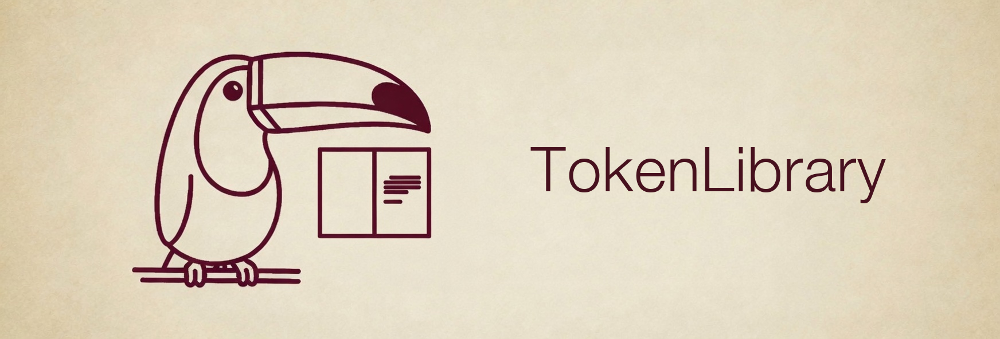
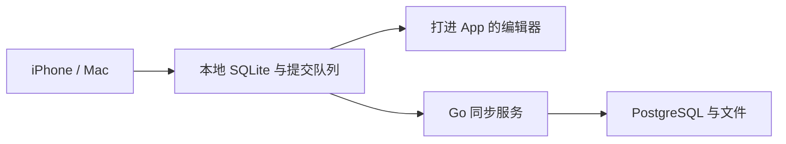

<p align="center">
  
</p>

# TokenLibrary

面向 iPhone、Mac 和自建服务器的个人资料库，管理书籍、论文、Markdown 笔记与 PDF 批注。

## 目录

- [现在做到哪一步](#现在做到哪一步)
- [架构](#架构)
- [快速开始](#快速开始)
- [仓库结构](#仓库结构)
- [公开命令](#公开命令)
- [文档](#文档)
- [安全](#安全)
- [安全审计](#安全审计)
- [许可](#许可)

## 现在做到哪一步

本地库、Markdown 与 PDF 编辑、连接和提交队列、服务端 API，以及书目和专题，已经有实现和分层测试。原生全旅程、公网部署和完整交付尚未关闭。

当前证据见 [开发与验收状态](docs/testing/development-status.md)。实施顺序和退出标准见 [实施路线](docs/plans/roadmap.md)。

## 架构



- `clients/`：iOS 与 macOS 两个 target。`Shared` 是界面，`LibraryCore` 管本地库、队列和同步。`clients/editor/` 是打进 App 的编辑器资源。
- `editor/`：编辑器源码和浏览器测试。构建产物进入 `clients/editor/`。
- `server/`：Go API、同步、合并和备份任务，数据在 PostgreSQL。
- `deploy/`：Compose 与 `manage.py`。`DEPLOYMENT=local` 时服务只绑定宿主机回环。
- `tests/`：跨进程验收、夹具和性能脚本。单元测试在 `clients/` 与 `server/` 内部。

组件边界见 [架构说明](docs/architecture/README.md)。

## 快速开始

需要 Docker Engine 或 Docker Desktop、Docker Compose v2、Make、Python 3.9 及以上。生成口令哈希还需要与 `server/go.mod` 一致的 Go。

```bash
cp .env.example .env
# 填写 DATA_ROOT、BACKUP_ROOT、POSTGRES_PASSWORD
# make hashcred 生成 ADMIN_PASSWORD_HASH，按部署文档写入 .env
make start mode=middleware
make start
```

这两条 `make start` 会校验配置并重建所选服务，因此会启动或重启它们。默认配置只绑定宿主机回环。真机同步要让 iPhone 和 Mac 使用同一个公网 HTTPS 地址。

客户端工程是 `clients/TokenLibrary.xcodeproj`。

数据目录、口令、上传令牌和公网证书的完整步骤见 [部署与连接排查](docs/operations/deployment.md)。

## 仓库结构

```text
.
├── .github                 # security-audit 持续检查
├── LICENSE                 # 本仓库代码与文档的 MIT 许可
├── assets                  # README 封面
├── clients                 # iOS / macOS、Shared、LibraryCore、打进 App 的编辑器
├── editor                  # 编辑器源码与浏览器测试
├── server                  # Go API、同步、合并、备份
├── deploy                  # Compose 与 manage.py
├── tests                   # 验收夹具、跨进程证明、性能脚本
├── docs
│   ├── architecture        # 现状组件边界
│   ├── product             # 个人图书馆设计
│   ├── research            # 体验、参考产品和可靠性调查
│   ├── plans               # 实施路线
│   ├── implementation      # 已落地的改动
│   ├── testing             # 验收证据
│   ├── operations          # 部署、备份、恢复
│   └── legacy              # v1 原文：功能设计、技术方案
└── third-party             # 只属于本仓库的外部技能与手册
    ├── security-audit-skill
    └── secure-agent-playbook
```

`.env`、`.local/`、`ui-prototype/`、依赖目录和构建产物列在 `.gitignore` 中，不进入版本库。

## 公开命令

根 [`Makefile`](Makefile) 是公共入口。`make` 与 `make help` 打印用法。

| 命令 | 用途 |
| --- | --- |
| `make start mode=middleware` | 启动 PostgreSQL |
| `make start` | 默认 `mode=service`。先确认 PostgreSQL 可用；`DEPLOYMENT=local` 启动 app，`DEPLOYMENT=server` 再启动 Caddy |
| `make logs mode=middleware` | 跟随 PostgreSQL 日志 |
| `make logs` | 跟随当前模式下的 app 日志；服务器模式同时跟随 Caddy。Ctrl+C 只结束跟随 |
| `make hashcred` | 用隐藏输入生成管理员口令哈希 |

`mode` 只接受 `service` 和 `middleware`。日志跟随取最近 200 行。

## 文档

分类入口是 [文档中心](docs/README.md)。

| 你要… | 打开 |
| --- | --- |
| 在本机跑起来 | [部署与连接排查](docs/operations/deployment.md) |
| 理解个人图书馆 | [产品设计](docs/product/personal-library-archive.md) |
| 看当前证据和未关闭项 | [开发与验收状态](docs/testing/development-status.md) |
| 看实施顺序 | [实施路线](docs/plans/roadmap.md) |
| 查某类验收记录 | [测试索引](docs/testing/README.md) |
| 看已经落地的改动 | [实施记录](docs/implementation/README.md) |
| 备份和恢复 | [备份、保留期与隔离恢复](docs/operations/backup-restore.md) |
| 读最初方案 | [功能设计 v1](docs/legacy/功能设计-v1.md)、[技术方案 v1](docs/legacy/技术方案-v1.md) |

## 安全

真实配置只放在被忽略的 `.env`。`.env.example` 里的数据库口令、管理员口令哈希和上传令牌哈希留空。文档不写密码、会话 Token、真实服务器密钥或用户资料。

## 安全审计

打开 pull request，或在 GitHub Actions 里手动运行 Security audit 时，用 `security-audit` 对 `server/` 和 `deploy/` 做一档 `quick` 审计。代理调用上限是 16。报告上传为名为 `security-audit` 的构建产物，不写入仓库。

`confirmed` 且严重程度为 `high` 或 `critical` 时，这次检查失败。`needs_validation`、`rejected`，以及没有写出 `findings.json` 的未完成运行，不因此失败。来自其他仓库的 pull request 不运行这条检查。托管 runner 提供不了该技能要求的系统级沙箱，所以运行目标程序的检查会留在 `needs_validation`。

同仓库运行需要 Actions secret `XAI_API_KEY`。没有这把密钥时，检查失败。

## 许可

TokenLibrary 自己的代码和文档以 [MIT License](LICENSE) 授权，版权所有 © 2026 liuzeyu4201。

`third-party/security-audit-skill` 保持 Cloudflare 的 MIT 许可。`third-party/secure-agent-playbook` 保持 CC-BY-4.0。
