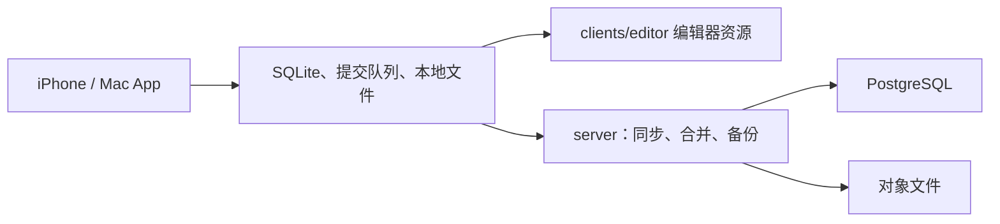

# 架构

TokenLibrary 把同一份个人资料库放在 iPhone、Mac 和自建服务器上。客户端持有本地副本和提交队列，服务器持有 PostgreSQL 里的权威库和文件对象，编辑器随 App 分发。

判断现状时，以代码和 [开发与验收状态](../testing/development-status.md) 为准。[legacy/](../legacy/功能设计-v1.md) 里写着「尚未实施」的段落是 v1 历史，不代表当前行为。已落地的取舍记在对应的 [实施记录](../implementation/README.md) 里。

## 数据怎么走

iPhone 与 Mac 共用 `clients/Shared` 界面和 `clients/LibraryCore`。编辑发生在打进 App 的编辑器里；同步由本地队列发到 Go 服务。服务默认通过 `deploy/` 的 Compose 只绑定宿主机回环，公网入口才改由 Caddy 终止 HTTPS。

## 目录职责

| 路径 | 职责 |
| --- | --- |
| `clients/iOS`、`clients/macOS` | 两个应用 target |
| `clients/Shared` | SwiftUI 界面与平台桥 |
| `clients/LibraryCore` | 本地库、检索、队列、同步客户端 |
| `clients/Tests` | 客户端模型与界面行为测试 |
| `clients/editor` | 打进 App 的编辑器 HTML、脚本和字体 |
| `editor/` | 编辑器源码、构建脚本和浏览器测试 |
| `server/cmd/tokenlibrary` | API 进程 |
| `server/cmd/library-admin` | 备份与恢复管理 |
| `server/cmd/hashcred` | 生成口令哈希和上传令牌 |
| `server/internal` | API、认证、同步、合并、存储、备份任务 |
| `server/schema` | 初始数据库结构 |
| `deploy/` | Compose、Caddy、镜像和 `manage.py` |
| `tests/` | 跨进程验收、合成夹具、性能脚本 |

`editor/` 是源码。`clients/editor/` 是客户端实际加载的那一份资源，不是另一套应用。

## 测试落在哪里

| 层次 | 位置 |
| --- | --- |
| 本地库与同步客户端 | `clients/LibraryCore/Tests` |
| 界面模型 | `clients/Tests` |
| 服务端 API、合并、备份 | `server/` 内的测试 |
| 编辑器浏览器行为 | `editor/tests` |
| 跨进程夹具和性能 | `tests/acceptance`、`tests/fixtures`、`tests/performance` |
| 命令、环境和双端记录 | [测试索引](../testing/README.md) |

各层证据不能互相替代。哪一层已经跑过，看 [总账](../testing/development-status.md)。
