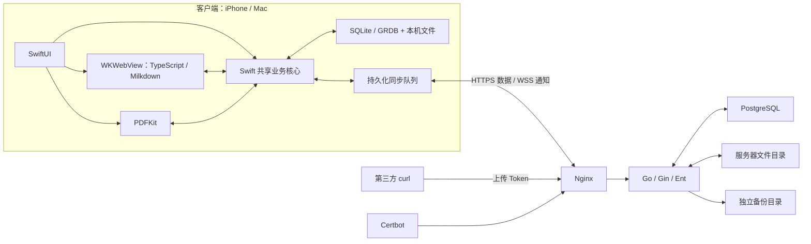

# TokenLibrary 技术方案

更新日期：2026-09-13  
状态：技术方案 v1.0，设计完成，尚未实施或联调。  
依据：同目录《功能设计.md》、此前逐项确认，以及用户本轮授权“其他你都自己定吧，只写完剩下的技术方案”。  
交付范围：iPhone、Mac 与现有 Linux 服务器组成个人文档库，全部约定功能一次实施和验收。本次仅交付技术文档，不创建应用代码、Makefile、容器配置或真实凭据，不执行部署。

## 1. 决策与总体架构

### 1.1 此前逐项确认的决定

以下 T01—T45 保留此前确认记录；本轮授权补全的具体实现统一写入后续章节，未表述为用户逐项确认。功能文档中的 D01—D08 采用原有设计默认并在本文落实，无需继续逐项提问。

| 编号 | 项目 | 决定 |
| --- | --- | --- |
| T01 | 客户端语言与界面 | Swift + SwiftUI，面向 iOS 和 macOS |
| T02 | 代码共享 | 共享业务、文件管理和同步核心，分别适配 iPhone 与 Mac 的界面和交互 |
| T03 | Markdown 编辑器 | 使用 TypeScript 编写，通过 WKWebView 嵌入应用 |
| T04 | 编辑器运行 | TypeScript 构建为 JavaScript；编辑器及渲染资源随应用打包，本地加载，支持离线运行 |
| T05 | PDF | 使用 Apple PDFKit，实现阅读、文字提取、高亮、文字批注与导出 |
| T06 | 职责分配 | Swift 层负责本地存储、文件管理和同步；TypeScript 层负责 Markdown 编辑及 Mermaid、LaTeX 集成 |
| T07 | 服务端语言 | 使用 Go 开发，部署到已有 Linux 服务器 |
| T08 | 服务端数据库 | 使用 PostgreSQL（PG） |
| T09 | 服务端文件存储 | PDF 和图片保存到现有 Linux 服务器的磁盘目录 |
| T10 | 部署方式 | 使用 Docker 部署服务端 |
| T11 | 一键启动与命令约束 | 使用 Makefile 提供一键拉起；具体 make 命令、目标名称及执行行为必须先与用户沟通确认，再编写 |
| T12 | 容器编排 | 使用 Docker Compose 管理部署中的服务与配置 |
| T13 | 启动入口 | 使用 `make start`，通过 `mode` 区分中间件与业务服务的拉取；已有的本项目相关服务先停止后重新启动 |
| T14 | 日志入口 | 使用 `make logs` 实时查看服务日志 |
| T15 | mode 分组与取值 | 只设置 `middleware` 和 `service` 两个 mode；前者管理 PostgreSQL，后者管理 Go 应用、Nginx 和 Certbot |
| T16 | 默认 mode | `make start` 不传 `mode` 时默认使用 `service`，启动或重启 Go 应用、Nginx 和 Certbot |
| T17 | Go 镜像构建 | 在 Linux 服务器上使用项目源码构建 Go 服务的 Docker 镜像 |
| T18 | 客户端本地存储 | iPhone 和 Mac 使用 SQLite 保存正文、目录、批注及待同步记录，PDF 和图片保存在应用持久化文件目录 |
| T19 | Markdown 编辑器组合 | 采用 Milkdown 作为 TypeScript 编辑器基础，集成 Mermaid 流程图与 KaTeX 数学公式渲染 |
| T20 | 前后台同步行为 | 前台运行且联网时及时同步；iPhone 后台利用系统允许的机会尽力同步，再次打开或恢复前台时自动检查并补齐 |
| T21 | 第三方上传认证 | 使用独立 API Token，仅授予上传文件权限，可单独更换或停用；iPhone 和 Mac 仍使用固定账号密码登录 |
| T22 | 客户端保持登录 | 首次联网登录后记住状态，联网使用自动续期；连续 90 天未连接服务器、主动退出或凭据被撤销后需重新登录。登录过期仍可本地读写，重新登录后继续同步 |
| T23 | Go HTTP 框架 | 采用 Gin，组织登录、上传、文档管理和同步等 HTTP 接口 |
| T24 | 数据库操作偏好 | 优先通过模型完成数据库操作，减少手写 SQL；服务端 ORM 采用 Ent，见 T25 |
| T25 | 服务端 ORM | 采用 Ent 定义模型并生成数据库操作代码，服务端组合为 Go + Gin + Ent + PostgreSQL |
| T26 | 客户端 SQLite 访问库 | iPhone 和 Mac 共用 GRDB，通过 Swift 模型访问本地 SQLite |
| T27 | 同步通信 | HTTPS 传输文档和同步变更，WebSocket（WSS）通知在线客户端检查更新；断线重连按进度补齐，前台定期检查以补偿通知遗漏 |
| T28 | 合并执行职责 | Go 服务器统一执行跨设备自动合并并确认最终版本；客户端负责编辑、离线保存和人工冲突处理，服务器校验冲突解决提交所基于的版本 |
| T29 | 全文搜索执行位置 | iPhone 和 Mac 在线、离线均查询本地索引；本地编辑与同步更新后更新索引，PDF 完成下载和文字索引后参与正文搜索，处理中展示进度 |
| T30 | 部署地址配置 | 当前没有域名，仅有公网 IP；服务器对外地址在部署时通过 `.env` 配置，具体值后续填写 |
| T31 | HTTPS 证书自动化 | 证书申请、续期和更新生效均由部署自动处理；组件与分组见 T32，执行步骤见第 3.2 节 |
| T32 | HTTPS 组件与部署分组 | 使用 Nginx 提供 HTTPS/WSS 入口，Certbot 申请和续期证书；二者与 Go 应用统一纳入 `service`，`middleware` 继续管理 PostgreSQL |
| T33 | 启动顺序与准备失败处理 | `make start` 先检查配置与依赖、准备所选分组镜像，成功后停止旧服务、重新启动并检查结果；`service` 要求 PostgreSQL 已可用，配置检查或镜像准备失败时原服务继续运行 |
| T34 | 日志分组与显示 | `make logs` 默认 `service`，支持显式指定 `service` 或 `middleware`；每个容器先显示最近 200 行，再持续跟随新增日志，附带服务名称与时间，Ctrl+C 只退出查看 |
| T35 | 数据库单版本范围 | 本次只设计并交付一套固定数据库表结构，首次使用时初始化；暂不设计或实施数据库升级、版本化迁移及自动迁移启动流程 |
| T36 | 服务器数据目录 | 通过 `.env` 指定统一的数据根目录，内部按用途分别保存数据库、PDF 和图片、HTTPS 证书及运行数据；实际路径部署时填写，日常重启保留数据 |
| T37 | 服务器自动备份 | 每天自动备份一次 PostgreSQL 应用数据库及对应 PDF、图片，保留最近 7 天的成功备份；存放位置见 T38，执行时间见 T41，实现见第 3.2 节 |
| T38 | 备份存放位置 | 保存在现有 Linux 服务器的独立目录，路径通过 `.env` 单独配置，实际值部署时填写；已说明同盘副本无法覆盖整盘损坏场景 |
| T39 | 备份期间的同步 | 备份期间暂停云端文档写入，客户端继续本地阅读和编辑，将修改保存在待同步状态，备份结束后自动继续同步；第三方 curl 上传需稍后重试 |
| T40 | 回收站与备份保留边界 | 回收站满 30 天后从文档库清除，新备份不再包含已清除内容；旧备份按自身 7 天期限清理，旧副本最多额外保留 7 天，不因新备份失败而延长 |
| T41 | 每日备份时间 | 默认每天北京时间凌晨 03:00 开始，按 `Asia/Shanghai` 时区解释执行时间，允许通过 `.env` 调整每天的开始时刻 |
| T42 | 业务后台任务执行 | 每日备份、回收站到期清理及过期备份清理由 Go 服务内部执行，PostgreSQL 保存运行状态和错误信息；任务随 Go 服务启停，重启后按记录检查未完成任务 |
| T43 | 文档与文件夹标识 | 使用创建时生成且保持不变的 UUIDv4；客户端在本机生成，支持离线新建，重命名和移动后沿用同一标识，各端按标识关联同一对象 |
| T44 | 对象修订号与提交基准 | 每个文档和文件夹各自维护服务端递增修订号，首次保存为 1，每次正式提交新状态加 1；客户端提交其编辑所基于的修订号，服务器已有更新时进入既定三方合并判断 |
| T45 | 写操作重试去重 | 每次独立写操作生成 UUIDv4 操作编号；同一次重试沿用编号，服务器保存原处理结果，重复请求不重复执行，新修改使用新编号 |

### 1.2 本轮补全的技术决定

| 范围 | 最终设计 |
| --- | --- |
| 应用形态 | iOS 17+、macOS 14+ 原生应用；默认下载整库；没有独立 Web 客户端 |
| 服务结构 | 单个 Go 进程，Gin + Ent；pgx v5 的 database/sql 适配作为 Ent 底层驱动；无 Redis、消息队列及对象存储服务 |
| 编辑格式 | CommonMark + GFM；Milkdown 定制节点保留 Mermaid、公式及未知源码；源码为存储依据 |
| 同步 | 对象 UUIDv4 + 对象修订号 + 操作 UUIDv4 + 全库顺序游标；HTTPS 拉取真实数据，WSS 仅提示 |
| 并发 | 单库写事务锁定同一 library 行，保证修改、去重记录和变更序号按提交顺序一致；文件传输不占用该行锁 |
| 合并 | Go 调用受控 Git merge-file 做 Markdown 三方文本合并；属性按字段合并，PDF 二进制冲突人工选择 |
| 长期离线 | 保留服务端修订摘要；客户端持久保存基准，超出正文保留期时提供可校验基准；永久删除与备份恢复单独处理 |
| 搜索 | SQLite FTS5 索引预生成的 Unicode 字符片段，支持中文单字、双字及混合文本；原文复核与定位 |
| 文件 | UUID 标识的不可变文件对象，SHA-256 校验；客户端分块上传、Range 下载；curl 单次上传并支持整次重试 |
| 认证 | 固定账号配置 + Argon2id 密码摘要；设备独立随机会话；上传密钥独立且只允许新建上传 |
| 数据结构 | PostgreSQL 与 SQLite 各一套固定初始结构；空库初始化，非空库只检查，不自动升级 |
| 备份恢复 | 每日 03:00，北京时间；暂停云端文档写入，pg_dump + 文件清单副本，7 天到期；恢复后更换同步世代 |
| 命令 | 保留已确认的 make start / make logs 和两个 mode；本次只定义行为，不编写 Makefile |



“三端一致”是同步完成后的最终一致。手机离线、文件未下载完或有待处理冲突时，界面分别呈现实际状态，不表示所有设备已经一致。服务器是跨设备版本的确认者，本地未上传内容也是必须持久保护的数据。

## 2. 客户端与编辑设计

### 2.1 工程模块与线程职责

两个 SwiftUI 应用目标共用 Swift Package `LibraryCore`。共享模型、GRDB 记录、文件管理、API、同步、搜索和合并材料；iPhone 使用导航堆栈与分段冲突界面，Mac 使用侧栏、多栏布局及并排差异。macOS 同一文档的多个窗口共享一个文档会话，不能各自独立覆盖 SQLite。

- `DocumentStore` 负责本地事务和状态观察；GRDB DatabasePool 使用 WAL、外键检查、5 秒 busy timeout 与 synchronous=FULL。
- 每个文档的编辑和同步操作经 Swift actor 串行协调。PDFKit 对象不跨线程共享；后台提取使用独立 PDFDocument 实例。
- SwiftUI 和 WKWebView 在主线程操作。解析、哈希、PDF 提取与网络传输不阻塞主线程。
- SQLite、文件与待同步队列位于 Application Support。完整文档不是可随时淘汰的缓存；缩略图和渲染结果才放 Caches。
- 两端默认下载正文、PDF、图片、批注和回收站未到期内容。下载未完成时显示状态，空间不足时暂停新下载并提示，保留既有文件及未上传修改。
- 持久目录按 libraryId 隔离。服务器地址变化不能自动把本地库上传到不同 libraryId。

GRDB 的当前发行版和要求可由官方仓库核对；本项目采用其记录、事务和观察机制，同步逻辑仍由应用实现。[GRDB 官方说明](https://github.com/groue/GRDB.swift)

### 2.2 Markdown 与源码保留

采用 Milkdown kit 的 CommonMark、GFM、历史、剪贴板插件，增加 Mermaid、数学公式与源码保留节点，不引入协作 CRDT 插件。客户端唯一正文依据是 UTF-8 Markdown；编辑器树是运行时表示。[Milkdown 官方说明](https://milkdown.dev/docs/guide/getting-started)

| 内容 | 保存与交互规则 |
| --- | --- |
| 常规排版 | 标题、强调、删除线、列表、引用、链接、代码块、分割线、表格、任务清单；兼容 CommonMark/GFM |
| Mermaid | fenced code block 的语言标记为 mermaid；点击图形进入源码编辑；必须支持 flowchart/graph |
| 行内公式 | `$...$`；金额中的美元符号可转义为 `\$`；公式编辑节点明确区分普通文本 |
| 块公式 | 独立 `$$` 包围的公式块；支持 KaTeX 支持表中的数学命令，不承诺完整 TeX 文档编译 |
| 语法错误 | 保留原始源码并显示局部错误，不阻止整篇保存；未知 Mermaid 图表保留源码 |
| 原始 HTML、未知扩展 | 以源码节点保留，不执行 HTML；无法无损拆分的段落保留整段并提供源码编辑 |
| 图片 | 库内使用 `asset://<blobId>`，由 Swift 解析本地资源；alt/title 保存；网络图片见下文 |

编辑器加载时不自动重写全文。每个 Markdown 块保留原始源码切片与树位置；未修改块直接复用切片，修改块使用固定序列化规则，复杂嵌套无法安全局部重写时提升到完整父块。原始源码导入后直到用户修改都保留原样；首次编辑只统一受影响部分的换行与格式，不静默删除未知节点。纯格式变化仍属于内容变化，不能以“归一化”为由覆盖远端修改。

Mermaid、KaTeX、编辑器代码及字体全部随应用打包。KaTeX 使用 `trust=false`、有限宏展开次数，宏作用域限定单个公式；Mermaid 使用 strict 安全配置并禁止交互跳转、初始化指令提升权限。排版失败显示源码；长图在可取消的渲染任务中执行，超过 2 秒改为点击重试预览，不阻塞保存。[KaTeX 选项](https://katex.org/docs/options)、[Mermaid 配置](https://mermaid.js.org/config/schema-docs/config.html)

导入外部 `.md` 时保留未提供的相对图片路径并标示缺失；客户端可选择图片重新关联。外链图片保留 URL，默认不自动访问；用户触发“下载图片到文档库”后由 Swift 下载、校验并替换为库内引用。服务器不代抓任意 URL。已下载的库内图片参与完整离线使用。

### 2.3 WebView 通信与本机保存

编辑页面由 `WKURLSchemeHandler` 提供打包资源和经过校验的库内图片映射。WebView 不持有登录或上传 Token，不直接访问云端 API。禁止任意导航、文件路径访问和远程脚本；点击普通链接由 Swift 交给系统浏览器。CSP 限制脚本、字体、图片来源，脚本仅来自本地包；图片请求必须关联当前文档的合法 blob 引用。

通信信封固定包含 `protocolVersion=1`、`messageId`、`documentId`、`editorSessionId`、`editSeq`、`type` 和 `payload`。Swift 与 TypeScript 都进行运行时校验。消息类型为 ready、load、change、saveAck、requestAsset、flush、remoteAvailable、error。Swift 使用结构化参数传入脚本，不拼接正文作为 JavaScript 执行。

每个编辑事务生成单调递增 editSeq；正文与 dirty 状态在同一 SQLite 事务保存，提交成功才返回 saveAck。普通输入合并窗口 100 毫秒、最长 300 毫秒；退出页面、切后台、导出前触发 flush。中文组合输入保留正在组合的草稿，不在 composition 期间重建 DOM。窗口关闭前等待保存完成；系统突然终止时只能保证最后一次已确认保存的数据，界面不得提前显示“已保存”。

同一消息重复到达只重发原确认。切换文档生成新的 editorSessionId，旧页面回调不得写入新文档。WebView 崩溃后从 SQLite 重建；尚未收到确认的变化显示未保存状态。只有本地 dirty 内容达到发送条件时才冻结成网络操作，持续输入不会为每个按键保存一份服务端版本。

### 2.4 PDF 与批注

PDFKit 负责阅读、选中文字、提取文本和导出。原 PDF 文件不可变，应用新增的高亮和文字批注单独保存，以 UUIDv4 识别。外来 PDF 自带批注作为原文件内容显示、导出时保留；应用编辑能力覆盖本软件创建的批注，不承诺编辑所有第三方专有注释类型。

每条批注记录 annotationId、documentId、pdfBlobId、type、pageIndex、bounds、quadrilateralPoints、color、text、createdAt、updatedAt。页码从 0 开始，坐标为 PDF 页面未旋转的 crop box 坐标系、单位 point；通过 PDFKit 坐标转换处理缩放和旋转，存储时保留 crop box 与页面旋转用于校验。几何值限定有限数值，序列化量化到 0.001 point；文字高亮保存多段四边形、选中文字与上下文以供定位检查。每条备注最多 16 KiB。

不同 annotationId 的新增合并；同一批注以字段为单位三方比较，互不冲突的文字、颜色变化可合并，矛盾修改及删除对修改进入冲突。几何字段整体比较，不拆分坐标自动混合。PDF 正文替换与并发批注必须校验 pdfBlobId；不把旧批注自动套到新 PDF。选择新 PDF 后，旧批注作为“待核对批注”随库同步，保留其原 PDF 供检查；手动迁移或删除后才能释放旧文件引用。

导出时创建 PDFDocument 副本，将适用于选定原文件的应用批注加入副本，再写出；不修改原文件，不把待核对批注错误写入新页。导出文件中的应用批注携带稳定标记，导出流程检测去重。受密码保护且不能打开的 PDF 显示“需要密码”，密码只在本机按用户操作使用；未解锁前允许保存和同步原文件，正文搜索与批注暂不可用。扫描件不做 OCR。

### 2.5 搜索与导出

本地 `search_chunks` 保存正文搜索片段、来源代次、Markdown 源码位置或 PDF 页号，以及归一化文本。标题单独索引。Markdown 搜索包含正文与代码、图表和公式源码；PDF 逐页提取已有文字，批注文字一并进入该文档搜索。索引不上传服务器。

为支持中文单字和双字，不直接依赖默认英文分词，也不只使用 trigram。SQLite 官方指出 trigram 的 MATCH 不匹配少于三个 Unicode 字符的子串。[SQLite FTS5 文档](https://sqlite.org/fts5.html#the_trigram_tokenizer)

采用固定的客户端预分词器 `search-v1`：

1. 对检索副本做 Unicode NFKC 和固定规则大小写折叠，保留原文与位置映射；不改变实际 Markdown。两个客户端共享同一实现及固定测试语料。
2. 每个文本片段最多 2048 个 Unicode scalar，相邻片段重叠 128 个。生成长度为 1、2、3 的连续字符片段，将各片段编码为由 ASCII 字母、数字构成的 token，并用空格分隔交给 FTS5 unicode61；这绕开系统中文分词差异。
3. 查询按空白拆成最多 8 个字面关键词，每词最多 128 个 scalar；长度 1/2 的词使用对应片段，长词使用三字符片段交集筛选，再在归一化原文中确认完整子串。多个关键词按文档取交集，可以位于不同页或段落。查询不开放 FTS 表达式执行。
4. 排序依次按标题精确命中、标题包含、正文匹配数量、更新时间及 UUID；摘要和跳转位置由原文映射生成，不使用编码 token 的位置作为用户位置。

编辑保存事务同时标记索引 dirty，后台 500 毫秒内调度；代次未变化才提交提取结果。搜索时优先补齐少量 dirty Markdown；PDF 单任务逐页处理，iPhone 并发 1、Mac 并发 2，取消后从已完成页继续。只对当前内容索引，回收站默认排除。删除、替换文件及新同步必须更新代次；索引损坏可以整库重建，正文和同步队列不受影响。

Markdown 导出有 `.md` 与含 `assets/` 的 ZIP 两种；打包导出改写副本内的图片引用为相对路径并保存完整图片。库内文件缺失时先提示下载，不能生成宣称完整的包。PDF 导出选定当前版本和可用批注；存在冲突时明确导出的是当前编辑稿还是服务器版本。导出副本不再参与库同步。

## 3. 服务端、部署和运维

### 3.1 Go 服务与固定数据库结构

Go 采用 Gin 路由层、业务服务、Ent repository、磁盘 BlobStore、同步合并器和后台任务模块。数据库驱动选 `github.com/jackc/pgx/v5/stdlib`，经 `database/sql` 接入 Ent；常规查询使用 Ent 模型，库级行锁、少量维护操作和固定初始 DDL 可使用受控 SQL。[Ent 的 pgx 集成说明](https://entgo.io/docs/sql-integration/)

单库连接池上限 10、空闲 5、连接最长 30 分钟；普通数据库语句超时 10 秒。仅运行一个 Go 实例。进程先独占持有共享数据目录的 runtime/app/instance.lock 文件锁，再使用独立 PG 连接持有固定 advisory lock；另一个实例拿不到锁则不就绪并退出。PG 连接断开时立即停止接纳写入、取消并等待后台子进程退出，最后退出进程；本地文件锁一直持有到工作停止，恢复后由 Compose 重启，避免数据库锁已释放而旧进程还在改文件。

PostgreSQL 和 SQLite 各自只有一套固定初始结构。构建产物携带规范 DDL 和结构摘要；空的应用 schema 在事务中创建表、约束、索引与初始化记录。部分初始化或不匹配的非空结构直接报错；禁止启动时对既有表调用自动修改结构的流程。Ent 代码生成发生在构建阶段，服务器运行时不生成代码、不自动迁移。结构摘要用于识别交付物是否匹配，不引入数据库升级版本链。

### 3.2 Docker Compose、数据和备份

#### 3.2.1 容器与网络

Compose project 名固定为 `tokenlibrary`，可部署到 Linux amd64 或 arm64，按服务器本机架构构建 Go。分组仍只有 `middleware`（postgres）与 `service`（app、nginx、certbot）；应用文件、PG 和备份均持久挂载。

只有 Nginx 发布公网 80/443。app:8080 与 postgres:5432 仅在项目内部网络可见；证书容器只访问 ACME 及其挂载，不接入 PG。PostgreSQL 不暴露到公网。Go 以固定非 root UID 10001 运行；数据库目录使用选定镜像的数据库 UID。目录准备只处理本项目新目录或检查既有目录，不能递归改变任意已有服务器目录权限。

app 在数据库断开时返回可重试的不可用状态，不将失败写入报告成功；客户端继续本地保存。`mode=middleware` 重启引发短暂连接中断后，app 通过自身重启及持久记录恢复。

#### 3.2.2 公网 IP、HTTPS 与证书

`PUBLIC_BASE_URL` 配置完整 HTTPS 地址；当前使用公网 IP，未来可配置域名，不把地址编译进应用。客户端首次连接填写同一地址，并校验系统信任链和证书标识。

公网 IP 使用 Let’s Encrypt 短期 IP 证书，Certbot 至少 5.4，采用 certonly + webroot + shortlived profile + IP 标识；IPv6 URL 使用方括号。IP 证书已经公开可用，不能将“必须先有域名”作为阻塞条件。[Let’s Encrypt 的 Certbot IP 证书说明](https://letsencrypt.org/2026/03/11/shorter-certs-certbot)

首次无证书时，Nginx 仅开放 HTTP-01 challenge 路径，其他 HTTP 请求返回维护页，不开放明文登录。端口 80 必须能从公网访问。Certbot 完成申请后生成证书就绪标记；Nginx 容器内的受控监视器检查证书与私钥匹配、有效期及 nginx 配置，成功后原子切换 HTTPS 配置并 reload。证书目录对 Nginx 只读，双方仅通过标记目录沟通，不挂载 Docker socket。

Certbot 每 6 小时检查续期，失败每 1 小时再检查并记录日志；成功 hook 写入新的证书指纹标记。HTTPS 仍使用旧的有效证书直到新证书校验通过。证书剩余不足 48 小时在服务状态显示错误；过期后客户端保留离线能力并显示连接错误，不降低证书验证。HTTP 非 challenge 路径在证书就绪后跳转 HTTPS。Nginx 支持 WSS Upgrade，空闲连接通过心跳保持。

#### 3.2.3 数据目录与配置

`DATA_ROOT` 与 `BACKUP_ROOT` 必须是不同且不互相嵌套的绝对路径，均与源码目录分离。路径不可为空、根目录或包含意外符号链接逃逸；启动检查失败时不改动目录。

| 宿主机位置 | 容器与权限 | 内容 |
| --- | --- | --- |
| DATA_ROOT/postgres | 仅 postgres 读写 | PG 17 镜像挂载到 /var/lib/postgresql/data |
| DATA_ROOT/files/objects | 仅 app 读写 | 完整不可变 PDF、图片；路径规则见第 7 节 |
| DATA_ROOT/files/staging | 仅 app 读写 | 分块上传与原子写入暂存 |
| DATA_ROOT/runtime/app | 仅 app 读写 | 受控合并临时文件、临时同步快照 |
| DATA_ROOT/runtime/acme | certbot 写、nginx 读 | HTTP-01 challenge |
| DATA_ROOT/runtime/cert-events | certbot 写标记、nginx 读 | 证书发布通知 |
| DATA_ROOT/certs | certbot 读写、nginx 只读 | 证书、私钥、ACME 账户 |
| BACKUP_ROOT | 仅 app 读写 | 独立完整备份、manifest 和临时备份目录 |

服务器 `.env` 仅供部署读取、权限 0600，不提交仓库；示例文件只给变量名与无效占位值。Compose 按服务分别注入所需变量，不把固定密码配置传给 Nginx 等无关容器。

| 变量 | 规则或默认值 |
| --- | --- |
| PUBLIC_BASE_URL | 必填，https://公网IP 或域名，不含路径、查询或用户信息 |
| DATA_ROOT / BACKUP_ROOT | 必填的绝对路径，部署时填写 |
| ADMIN_USERNAME / ADMIN_PASSWORD_HASH | 固定用户名与 Argon2id PHC 摘要，部署时填写，禁用默认密码 |
| UPLOAD_TOKEN_HASH / UPLOAD_TOKEN_ENABLED | 独立高熵上传 Token 的 SHA-256 摘要，默认仅在正确配置后启用 |
| POSTGRES_DB / POSTGRES_USER / POSTGRES_PASSWORD | 默认库和用户 tokenlibrary，密码必填；仅 app 与 postgres 获取连接所需配置 |
| ACME_EMAIL | 必填的证书联系邮箱；签发同意条款在实际部署流程中呈现 |
| BACKUP_TIME / BACKUP_TIMEZONE | 03:00 / Asia/Shanghai；时间可改，时区明确解释 |
| BACKUP_TIMEOUT | 默认 20 分钟，可按实际数据量调整 |
| LOG_LEVEL | 默认 info，正文与凭据禁止进入日志 |

PDF 50 MB 明确定义为 50,000,000 字节，MD 限 5,000,000 字节，单图 20,000,000 字节；JSON 同步请求解压后上限 32 MiB，curl multipart 上限 52 MiB。这些是本版资源边界；MD 超限仍可在本机保留并导出，显示不能同步的具体原因，不截断正文。文档数 1000 是设计与验收目标，服务不在第 1001 篇硬拒绝。

#### 3.2.4 每日备份与一致性

Go 调度器每 30 秒检查计划。每天北京时间 03:00 执行；服务启动时如果最近一次应执行的计划没有成功结果，补做最近一次，不补齐每个停机日。相同计划失败后在 15、60 分钟重试，最多三次（含首次），之后等待次日；过期备份清理不依赖备份成功。

备份流程固定为：

1. 先执行到期回收站清理和过期备份清理。若到期数据未能完成逻辑清除或专属文件物理清理，本轮备份失败，不生成包含这些数据的新备份。
2. 取得进程内云端写入独占门闩，暂停新上传、文档修改、冲突修改、文件发布和文件 GC；最多等待已有写操作 60 秒，未完成则取消本次备份并解除暂停。读请求和客户端本地编辑继续。
3. 在暂停窗口内记录快照时刻，用与 PG 主版本相同的 pg_dump custom 格式导出完整应用数据库；根据数据库中仍有效的 blob 引用生成清单并逐个复制文件到独立的临时备份目录。不用硬链接，避免把活动文件和备份保留期绑定。
4. 清单包含 backupId、libraryId、epoch、结构摘要、快照 UTC 时间、到期时间、库转储与每个文件的大小和 SHA-256。覆盖当前、回收站、未解决冲突、保留基准与待核对批注仍引用的文件；未完成上传不作为可恢复文档纳入。
5. 校验文件与 dump 校验值、执行 pg_restore 列表检查；目录和文件持久写入后，以原子改名发布成功目录。完整恢复有效性还由第 10 节的隔离恢复验收验证，目录存在不等于恢复已验证。
6. 记录结果并释放门闩，通知客户端继续同步。失败、取消或 20 分钟超时均终止并等待复制/导出子进程退出，删除临时结果，最后解除暂停；不让旧任务继续发布成功标记。

pg_dump 提供数据库一致快照，不包含数据库外的文件；本项目通过短时暂停应用写入协调联合备份。[PostgreSQL pg_dump](https://www.postgresql.org/docs/current/app-pgdump.html)

备份期间新云端写操作返回 503 MAINTENANCE、Retry-After: 30；已提交操作的去重结果查询和正常读取仍可用。会话活动记录可更新，因为它不改变文档与 blob 引用；恢复后所有会话重新登录。用户不会因为本地编辑收到保存失败，界面显示等待服务器恢复同步。

#### 3.2.5 备份恢复

恢复是管理员在服务器上的显式维护操作，不提供自动覆盖现库的 HTTP 接口，不新增 make 目标。实施交付包含逐步恢复说明及内部校验工具；本次只确定流程：

1. 停止本项目 service，校验选定备份未过期、manifest 和全部哈希，确认结构摘要及 PG 主版本匹配。先保留当前活动数据目录供恢复失败时回退，不能边覆盖边验证。
2. 在隔离新目录及空数据库恢复 dump 与完整文件；检查外键、正文、当前修订、冲突及所有 blob 引用。原 `.env` 与证书保留独立配置，不从备份覆盖正在使用的登录秘密。
3. 保持 libraryId，生成全新 epoch；注销全部设备会话，放弃旧 epoch 的上传任务、分页快照与处理中的后台任务，重建调度记录。按当前时间处理回收站和备份到期，再切换活动数据并启动。
4. 客户端重新登录，检测 epoch 不同后停止重放旧队列；先保留本地 working、shadow、队列和基准，再拉全量快照。与本机无差异的数据继续使用；有差异、服务器缺失或恢复前已确认的后续编辑统一进入“服务器恢复后的差异”列表，由用户选择保留云端、合并或显式另存。
5. 新 epoch 下重新生成操作编号并校验新基准后才能提交。旧操作即使有原编号也不直接执行，避免恢复前的幂等记录回退导致重复新建。

运行配置和证书不是每日业务备份的恢复前提：备份中保存无秘密的配置说明，账号摘要、PG 密码及证书依靠现有部署配置；证书丢失可重新申请。恢复后的差异处理是整库故障恢复所需能力，不增加逐篇历史版本浏览功能。

#### 3.2.6 回收站删除与备份保留边界

回收站以服务器正式确认的 deletedAt 计时，30 天到期。所有读取、导出材料获取和还原接口实时检查 purgeAt，不能因定时任务延迟继续提供过期对象。服务运行时每 60 秒检查，先将到期项目从文档库逻辑清除，删除正文、所有修订正文、临时同步快照正文、冲突材料、草稿、批注及专属引用，再完成无引用文件的物理清理。只保留不含名称和正文的 UUID 删除标记。共享 blob 仍被其他存活文档引用时保留，不能因一篇文档删除而破坏另一篇文档。

每份备份以快照时刻 + 7×24 小时为到期时刻，与任务完成时间或最后成功时间无关。每 60 秒独立检查过期备份，先标记不可恢复，再清除实际目录；新备份失败也照常清理，不能无限保留最后一份。恢复界面和恢复工具实时检查有效期，不允许因调度延迟使用过期备份。

备份过程若跨过某条回收站到期时刻，检查 manifest 的最早 purgeAt；发布前已经到期则本轮作废、解除门闩、执行清理后按重试计划再备份，不能发布含已过期专属内容的新备份。

“30 天/7 天”是业务可用期限；正常运行的物理清理在下一次检查完成。停机、磁盘故障或权限错误时不能承诺机器实际执行删除：服务恢复后先检查清理，未成功的删除记录错误并禁止该结果再用于读取或恢复。期限不因故障获得延期；不将该功能描述为磁盘取证级安全擦除。

客户端收到永久删除时清除已同步副本和索引；若有未上传改动，先隔离到待处理恢复稿，由用户选择丢弃或另存新 UUID，不自动复活旧 UUID。离线设备和用户导出的外部副本无法被服务器即时清理，沿用功能设计的边界。

### 3.3 启动与日志命令契约

只保留已确认命令：`make start`、`make start mode=service`、`make start mode=middleware`，以及同样 mode 用法的 `make logs`。两个入口省略 mode 均为 service；mode 为空或其他值时报错。裸 `make` 在本版定义为仅展示这两个入口及用法，不启动或停止任何服务，不增加对外目标。

start 的内部行为：校验配置与目录 → 检查依赖 → 准备镜像 → 全部成功才停止所选分组 → 重新创建并启动所选容器 → 检查就绪。镜像构建、拉取与启动分开，准备失败保持原服务运行。[Compose build](https://docs.docker.com/reference/cli/docker/compose/build/)、[Compose pull](https://docs.docker.com/reference/cli/docker/compose/pull/)

- middleware 只拉取锁定 PG 镜像，停止/重建 postgres；保留 PG 数据，不删除卷。
- service 要求现有 PG 已可用，先基于服务器当前源码构建 app，再拉取锁定 Nginx、Certbot；准备成功后停止 service，按 app 初始化、Nginx challenge、证书就绪、HTTPS 验证顺序启动。不自动 git pull，不自动启动 middleware。
- 从当前源码构建 Ent 生成代码和 Go 二进制；代码生成失败属于镜像准备失败。临时构建文件留在镜像构建上下文中，不修改已有生产数据。
- 停止宽限期 30 秒，普通请求停止接纳后排空；同步任务已持久保存，上传保留已完成块。备份中则取消任务，临时结果不可发布。
- PG 在 60 秒内就绪；app 在 90 秒内完成空库初始化/结构检查及文件检查；首次 HTTPS 最多等待 10 分钟。失败返回非零并显示失败组件，不能宣布启动完成。不承诺停止后的自动回滚或零停机。
- 不以 down -v 或删除目录实现重启；操作范围严格限制于本项目和所选分组。

logs 显示所选分组每个容器最后 200 行并持续跟随，带服务名、时间。Ctrl+C 只退出查看，无容器时提示并退出，不启动服务。[Compose logs](https://docs.docker.com/reference/cli/docker/compose/logs/)

所有容器 stdout/stderr 使用 Docker local 日志驱动，默认每文件 10 MiB、保留 5 个。Go 用 JSON 结构化日志，字段包括 requestId、operationId、对象 ID、耗时和错误码；不记正文、图片、PDF 内容、密码或完整认证头。应用内同步状态展示最近失败与可重试原因，不另接外部通知服务。

### 3.4 就绪、后台任务与故障检查

`/health/live` 仅反映进程存活；`/health/ready` 检查 PG 连通、固定结构摘要、单实例锁与文件目录可写。备份期间服务仍可读，ready 返回正常并携带 maintenance=true。磁盘不足拒绝新文件写入，既有文档读取继续；DB 不可用时 ready 返回 503。

`jobs` 记录任务类型、计划时刻、runId、状态、心跳、开始/完成时间、次数及错误摘要；同类任务互斥。进程启动将遗留 running 标为 interrupted，校验临时目录与成功 manifest，重新安排允许重试的最近任务。备份、回收站清理与文件 GC 受同一写门闩协调；备份目录到期清理独立执行，不能删除正在发布的目录，且不能因新备份一直失败而停止。

文件一致性巡检每天一次，检查数据库引用存在及文件长度；每周全量校验 SHA-256。缺失或损坏时将 blob 标记 unavailable，向两端同步文件状态，不静默删除文档。经校验仍持有同一哈希原件的客户端可重新上传修复原 blob；修复也经过正常鉴权、门闩和原子发布。

## 4. 同步协议与冲突处理

### 4.1 标识、版本和内容基准

| 字段 | 定义 |
| --- | --- |
| libraryId | 初始建库生成的 UUIDv4，标识个人文档库；普通重启和恢复备份保持不变 |
| epoch | 同步世代 UUIDv4；首次创建和整库恢复时生成，普通部署重启不变 |
| objectId | 文档或文件夹 UUIDv4，客户端离线生成；改名、移动和回收站还原均保留 |
| revision | 每个对象独立的服务端修订号，首次提交为 1；正式提交新状态才 +1 |
| operationId | 一次不可变逻辑写操作的 UUIDv4，重试复用；新内容、新基准使用新编号 |
| changeSeq | 同一 epoch 下的全库提交序号；一项事务可影响多个对象，共用一个 changeSeq |
| baseRevision / baseHash | 客户端修改所基于的服务端修订及快照 SHA-256 |
| localGeneration | 客户端本地编辑代次，与服务端 revision 分开，不上传为服务端版本 |
| blobId / sha256 | 文件 UUID 与完整文件内容校验值，文件名不承担身份作用 |

UUID 在 API 使用小写带连字符字符串，PostgreSQL 用 uuid、SQLite 用规范字符串。revision、changeSeq 等 64 位计数器在 JSON 用十进制字符串，避免 TypeScript 数字精度损失。时间统一使用服务器 UTC、RFC 3339 毫秒字符串，客户端时钟不决定冲突胜负或回收站期限。UUIDv4 不用于排序。[UUIDv4 规范](https://www.rfc-editor.org/rfc/rfc9562.html#section-5.4)

服务端生成不可变 `snapshotBytes`：固定字段顺序、UTF-8 JSON、整数几何坐标、按 UUID 排序的批注和资源引用；包含对象可同步状态、revision，不包含下载进度、会话等本地状态。直接对这段原始字节计算 SHA-256。客户端保存服务器返回的原始字节，不通过 Swift/TS 重新序列化来猜测同一哈希；需要提交基准时以 base64 携带原字节。

客户端 desiredSnapshot 使用 `canonical-v1` 编码：字段名仅限协议内 ASCII 键、按键排序；数组按规定身份排序（正文字符串不排序）；整数用十进制、禁止浮点/NaN；字符串保留 Unicode 原字符，只按固定 JSON 转义规则转义控制字符、引号和反斜杠，不转义斜杠。可选字段明确为 null，禁止忽略和 null 混用。Swift 在冻结操作时保存这段字节；Go 用同一规则校验和计算 inputHash，响应回传 receipt 的 operationId 与 inputHash。receipt 基准使用这些已保存的输入字节，不用服务器后来合并的正文冒充原输入。三端用黄金样本验证编码一致性，不以默认 JSON 编码器设置替代此契约。

服务端 `revisions` 保留活动对象所有 revision 的哈希、提交时间和关系；完整历史 snapshot 保留 90 天，当前版本及未解决冲突引用的基准不按 90 天清除。同步变更正文引用的快照至少保留到相关变更记录过期。没有历史恢复界面。

离线超过 90 天时：客户端随修改提交其持久基准 snapshotBytes，服务端按该对象、epoch、revision 的历史哈希验证后参与合并。缺失或不匹配时返回 BASE_REQUIRED/BASE_INVALID，保留本地内容并进入人工比较，不能使用客户端自报的数字直接覆盖。对象永久清除后删除其完整修订和摘要，仅留下删除标记；此时不再接受其旧基准重建原对象。

### 4.2 客户端同步队列与旧响应保护

本地明确区分三份状态：`shadow` 是最后知道的服务器状态；`working` 是用户当前编辑内容；`outbox` 是已冻结待发送的操作。dirty 草稿保存首次偏离服务器时的 `editBase`，不能被后续拉取替换。

1. 每次编辑先将 working、localGeneration 和 dirty 记录在同一 SQLite 事务提交。
2. 停止输入 800 毫秒后冻结请求；持续输入时每 5 秒最多形成一次发送机会。单个对象同时只有一项网络写操作，后续修改留在 working，尚未发送的连续草稿可合并。
3. 冻结时生成 operationId，保存 baseRevision、baseHash、基准字节、desiredSnapshot、epoch 与 requestHash。首次发送后请求不可再修改，即使超时也保持原样重试。
4. 发送期间收到远端版本，只更新 shadow 并提示远端变化；working 有修改时不能直接替换编辑器。没有本地修改时，先持久化再更新界面。
5. 较早操作返回后，只确认对应 operationId。同一 epoch 内 shadow 的 revision 只能前进；若此前已拉到更高 revision，较旧 ACK 只确认操作，不能回滚 shadow。若 working 的 localGeneration 等于发送代次，显示目前已知的最新服务器结果；若已有新输入，则保留 working，以之前发送的 desiredSnapshot 为下一段编辑的基准候选。
6. 服务端为成功或冲突的已接收提交保留该 desiredSnapshot 的哈希证明（operation_receipt）。客户端的新修改可使用该 receipt 作为共同基准，服务端验证后合并“上次已接收的输入之后的本地变化”与服务器合并结果。不能把旧 working 直接标成基于新 revision，否则会抹掉上一轮合并进来的远端内容。

receipt 只可由客户端会话在同一 libraryId/epoch/objectId 使用，不能由上传 Token 用来改写文档。服务端保留输入哈希、对象与提交关系；客户端持有输入原字节，服务器无需永久存所有请求正文。若上次操作产生冲突，同一对象的后续自动上传暂停；用户最新 working 保存为该冲突的本地续写稿，先在冲突界面合并，再提交新的解决操作。

依赖关系按文件夹创建 → 子文件夹 → 文档及资源完成 → 文档引用发布顺序执行。单设备最多并行处理 2 个不同对象的修改、2 个文件传输；同一对象和关联目录操作串行。一个对象冲突不阻塞其他对象同步。

### 4.3 服务端事务、去重与重试

Go 每个库的逻辑写入在数据库事务中先锁定 library 行，再检查 epoch、operationId、基准、对象状态、名称与父级。随后提交对象新状态、修订摘要和快照、必要冲突、操作结果与 changeSeq。所有会改变库的入口，包括 curl、新建、批注、恢复和后台删除，使用同一事务入口。

changeSeq 使用 library 行内普通 bigint 字段在事务内递增，不使用独立 sequence 的分配顺序来假定提交顺序。后来的事务必须等待前者提交/回滚后取得行锁，因此不会产生“较大序号先可见，较小序号稍后提交被跳过”的遗漏。文件流传输和 PDF 校验在取得该锁之前完成；锁内合并最多 2 秒，超时终止该次事务并保留可重试状态。[PostgreSQL 行锁](https://www.postgresql.org/docs/current/explicit-locking.html)

操作去重键是 `(libraryId, epoch, operationId)`，均非空并具有唯一约束。请求还绑定主体类型、动作、对象标识及确定性请求哈希。同一编号不同输入返回 409 IDEMPOTENCY_MISMATCH；重复请求每次仍需通过当前身份和权限检查。上传 Token 更换后新的有效上传 Token 可以重试旧上传编号，但不能取得文档正文。

去重记录只保存紧凑结果：状态、对象 UUID、当时 revision/changeSeq、conflictId、输入哈希及必要关联。当前 epoch 内长期保留这些小记录；不把文档正文、文件名和整个响应 JSON 无限保留。短期完整响应缓存最多 24 小时，永久删除时立即去除其中敏感内容；旧重复请求返回原操作结果的编号和状态，最新正文另走读取接口。对象已清除时返回原操作已处理且对象现已清除，不再创建文件。

新建对象只接受尚未出现且不在 tombstone 中的 UUID；更新接口永远不能隐式 upsert 为新文档。失败分类：

| 结果 | 去重与客户端行为 |
| --- | --- |
| 已正式提交 / 已记录冲突 | 持久保存结果，同编号直接返回；不额外推进 revision |
| 内容无变化 | 保存 no_change 结果，不推进对象 revision 或 changeSeq |
| 语义失败，如重名、目录失效 | 固定请求保存 rejected 结果；用户修正输入后使用新 operationId |
| 鉴权失败、503 维护、限流、未提交的暂时故障 | 不形成成功结果；原请求可在条件恢复后重试 |
| 同一操作仍在处理 | 最多等待 3 秒，返回 202 processing + Retry-After: 2，后续查询或重试 |
| 请求已提交但连接断开 | 返回原保存结果；文件、名称后缀和修订号不重复产生 |
| epoch 不同 | 409 EPOCH_CHANGED；先走恢复核对，不能自动更换 epoch 后重放 |

客户端网络错误和 5xx 使用带抖动的 1、2、4、8、16、30、60 秒退避，最大 60 秒；无次数上限但持久记录最近错误。401 暂停云端同步等待登录；403、413、422 等需要处理输入，不能高速循环重试；429 和维护遵循 Retry-After。用户手动重试可以提前唤醒一次，仍沿用原编号。

### 4.4 Markdown 与字段三方合并

先比较 base、local、remote 三者：local=base 采用 remote；remote=base 采用 local；local=remote 采用同一结果。名称、parentId、回收站状态逐字段处理；两端把同一字段改成不同值时为冲突。不要用客户端修改时间作最后写入者覆盖。

Markdown 文本采用 Git merge-file 的三方行合并，明确使用 `--diff3` 输出共同基准和 `--diff-algorithm=histogram`。Go 通过参数数组运行固定可执行文件；临时目录用随机名称、权限 0700，不使用用户文件名作为路径，不调用 shell，不读取用户 Git 配置，不启用 ours/theirs/union。无须创建 Git 仓库。退出码 0 才视为无文本冲突，1—127 表示冲突，其他退出状态或超时视为执行失败，不发布输出；临时正文在调用结束时清理，崩溃遗留在下次启动接纳请求前清理。[Git merge-file 官方说明](https://git-scm.com/docs/git-merge-file)

Go 使用 Markdown 解析器识别 fenced blocks、数学块和资源引用，合并后校验图片引用是否完整。若两端都修改同一个 Mermaid 代码块或公式块，保守地把整个块作为冲突处理，即使行合并没有标记，也不自动拼接可能失去含义的源码。普通不同段落兼容修改自动合并；同段不同字的行冲突允许人工处理。

冲突记录包含 objectId、kind、冲突产生时的服务器 revision、基准/本地/远端快照及哈希、发起 operationId、状态和 conflictRevision；冲突也进入全库变更记录。若一次对象提交的任意字段有冲突，本次 desiredSnapshot 整体进入冲突记录，不先提交部分字段，让用户能比较完整意图。服务器当前版本继续存在，其他独立对象照常同步。

同一对象已有未解决冲突时，继续接收其他设备的分歧为单独冲突分支，不覆盖旧冲突；有冲突的对象显示待处理。冲突解决请求带当前 object revision、全部所解决 conflictId 及 conflictRevision、最后看到的服务器 hash。检查期间任一变化则返回 409 CONFLICT_STALE 并提供最新材料，保留解决草稿，不能拿过时解决稿直接写入。成功后同一事务提交新版本并关闭选定冲突；没有解决的分支仍标示待处理。

两端均可编辑并同步冲突解决草稿；草稿自身使用 draftRevision 条件更新，并携带所见 conflictRevision。更新发现草稿修订落后时，保留原草稿并创建新的 draftId 分支，返回 draft_forked 和两个版本的标识；不覆盖另一个设备的稿。草稿新建、更新和分支也写入 changes，其他设备能够获取。最终解决正文才能成为普通文档版本。过大的冲突材料分开下载和缓存，正文预览不阻止本地保存。

### 4.5 PDF、目录、名称与删除冲突

| 场景 | 确定行为 |
| --- | --- |
| 同一 PDF 原件上不同批注 | 按 annotationId 合并新增；同条批注按第 2.4 节比较 |
| 两端替换 PDF | 相同 SHA-256 可归并为同一内容；不同原件保留两者待选，不做二进制合并 |
| 替换 PDF 对并发批注 | 整体生成冲突，记录原 PDF 与批注的版本关联；解决后仍未迁移的批注进入待核对状态 |
| 改名对正文修改 | 属性和正文兼容时一起提交 |
| 不同改名、不同移动 | 同字段冲突；选定最终值后重新校验重名和目录 |
| 移入已删除目录 | 拒绝普通移动，提示选择有效位置；保留文档和本地意图 |
| 删除文档对未见过的编辑 | 产生删除/编辑冲突，不直接丢掉编辑；删除已提交的一方保留在回收站 |
| 永久删除对离线编辑 | 旧 UUID 永不重建；保留本地恢复稿，用户可显式另存新 UUID |

同一 active 父目录内名称唯一，文档和文件夹共用名称空间。名称使用 NFC、去除首尾空白、Unicode casefold 生成 nameKey；禁止空名、`.`、`..`、路径分隔符、控制字符，UTF-8 长度最多 240 字节，预留后缀空间。文档扩展名与类型一致，文件夹名称不依赖文件系统路径。

上传/导入重名时在扩展名前找可用的 `_1`、`_2` 等最小正整数后缀，例 `报告.pdf → 报告_1.pdf`。锁定库行后分配名称并依靠唯一约束兜底，两个并发上传不会选中同名。对已经带后缀的上传，将原文件名视为完整基名继续添加后缀，规则可预测且不解析用户自带编号。普通手动重命名或恢复重名返回 NAME_CONFLICT，由用户调整，不自动覆盖。

文件夹深度最大 32；服务端每次移动递归检查新父节点不是自身或后代，两个交叉移动由同一写事务锁串行验证。库根目录 UUID 由服务器初始化，不允许移动、改名或删除。

删除文件夹时客户端提交已看到的完整 active 子树 `(objectId, revision, parentId)` 清单，服务器在同一事务比较当前成员和修订，完全一致才将整棵子树放入同一 trashBatch；存在新子项、并发编辑或成员移动则记录目录删除冲突，让用户重新检查，不能静默删除没见过的更新。独立已在回收站的项目不重置其原有到期时间。

回收站项目把 parentId 置空，另外保存 originalParentId、trashBatchId 和恢复层级；originalParentId 是历史位置，不要求其目标永久存在。还原整批前验证目标父级、完整层级和所有名称，成功则整体提交；单独还原子项可选择新父级并退出原批次。父目录被清除不提前清除独立回收站项目，后者仍按自己的 purgeAt 计时。

### 4.6 增量拉取、首次同步与全量重建

changes 每条包含 epoch、changeSeq、事务内全部受影响对象的 UUID/revision、conflictId/revision 或永久删除标记；不直接把整篇正文重复放进日志。日志保留 90 天，正文由不可变快照读取接口获取。清理后的游标返回 410 CURSOR_EXPIRED，不能把缺失记录当成没有更新。

增量流程：

1. 拉取 `after` 之后最多 100 个事务事件；响应带 nextCursor 和 hasMore，不拆开一个事务的元数据。大型文件夹事务允许返回一个较大的事件。
2. 客户端下载需要的不可变对象/冲突快照，在本地暂存；所有必要元数据已齐备后，用一个 SQLite 事务更新 shadow、冲突状态、blob 下载任务及 cursor。working/outbox 另行保护。
3. 其中一个快照已被永久删除或超出保留期时，服务器给出可校验的 tombstone 或要求全量同步；不能用当前版本假装被请求的旧修订。收到 tombstone 后抑制后续旧事件对该 UUID 的重建。
4. PDF 和图片的下载独立推进并持久化，元数据游标可先前进；完整下载、校验和搜索索引各有状态。进度已前进不意味着文件已下载。
5. 本地事务失败不推进 cursor；同一页重放按 UUID/revision 和 tombstone 幂等应用。下载快照失败保留暂存，不部分确认该页。

首次同步或游标过期时，服务器在 Repeatable Read 事务内建立固定清单：记录当时 changeSeq，并固定当前对象与回收站的不可变 revision 引用，以及未解决冲突和草稿的当时内容。对象正文不重复复制进临时表，其引用的 revisions 被 pin 到快照到期。分页读取该固定快照，不能边翻页边读取变化中的实时对象表。快照使用 snapshotId，默认 30 分钟到期，每设备最多保留 1 份，按 100 项一页；大正文按 snapshot item 另取。快照创建取得库行锁，保证清单引用与并发删除、版本清理一致，创建、过期与引用保留均受写入门闩管理。

快照建立遇到 PostgreSQL serialization failure 时整个事务回滚，重新开始最多 3 次；仍失败返回可重试错误，不能保留不完整清单。该清单只固定文档视图，不推进业务 changeSeq。事务内只做数据库引用与必要冲突副本，文件传输放在事务之后。

全量快照中的 blob 在快照有效期内被引用保护；对象到期永久删除优先于快照保留，涉及该对象的快照直接失效并要求重新创建，清除其正文，不能把已清除内容留在临时快照。并发读取在删除前取得的数据不承诺能从设备追溯收回。

客户端先保存未同步 working/outbox/editBase，再把完整快照装入 shadow 暂存表。下载完全部元数据后原子切换 shadow/cursor，保持 dirty 文档，继续从快照游标拉增量。相同 epoch 下 pending 操作先查询原 operationId 结果；未执行的旧修改仍用真实基准合并。全量快照里缺失而本机已知的对象通过 tombstone 查询确认，绝不能把所有本地缺失对象当成新建重新上传。

### 4.7 通知、前后台与同步状态

WSS 在服务器提交后发送 `{type:"changes_available", epoch, latestSeq}`；不发送正文、文件或凭据。丢通知不影响正确性。客户端收到通知合并 200 毫秒内的重复提示后拉取；前台每 30 秒检查一次最新 cursor。WSS 每 25 秒 ping/pong，60 秒未响应断开并按重试退避重连。每次重连、打开应用、回到前台及恢复网络都触发拉取。

iPhone 的后台 URLSession 用于文件传输，BGTaskScheduler 用于系统允许的同步机会；任务过期时保存进度并取消未完成计算。iOS 不保证后台持续执行或固定时刻运行，不能作为“随时三端实时一致”的前提。[Apple 后台执行策略](https://developer.apple.com/documentation/backgroundtasks/choosing-background-strategies-for-your-app)

Mac 在进程运行、联网且未休眠时同样持续同步；系统退出或休眠前只完成本机持久保存，恢复后补齐。后台不能完成登录、网络被阻断或证书错误时保持本地工作。

状态由不同维度合成：本机保存是否完成、outbox 数量、服务器确认版本、增量是否补齐、文件下载是否完成、索引进度、冲突数量。只有本机当前代次已获服务器确认、无待处理冲突时才显示该内容已同步；“本机离线就绪”还要求全部关联文件完整。不得把两端所有设备在线与否推断为已同步状态。

## 5. 数据模型与约束

### 5.1 PostgreSQL 固定模型

业务表统一关联 libraryId，单用户并不省略库身份校验。下表是本版固定结构的模型契约；命名采用 snake_case，时间字段 timestamptz，计数器 bigint，哈希 bytea，快照原字节 bytea，受约束的扩展结构 jsonb。Ent 生成常规访问代码，关键锁与约束在初始化 DDL 中明确。

| 表 / Ent 模型 | 主要字段 | 关键约束与用途 |
| --- | --- | --- |
| schema_info | fingerprint、initialized_at | 仅一行；检查本版固定结构，不记录升级链 |
| libraries | id、epoch、root_id、change_seq、created_at | 单库行，也是写事务序列化锁对象 |
| devices | id、library_id、name、platform、last_seen_at | UUID；同库设备身份用于操作来源，不承担账号认证 |
| sessions | id、device_id、token_hash、last_seen_at、revoked_at、credential_generation | hash 唯一；按 90 天不活跃到期 |
| objects | id、library_id、kind、parent_id、name、name_key、revision、state、deleted_at、purge_at、trash_batch_id、original_parent_id、updated_seq | kind 为 folder/md/pdf；当前对象公共状态；parent 必须为 active folder，根节点例外 |
| documents | object_id、markdown_source、pdf_blob_id | object_id 唯一 FK；md 与 pdf 类型字段互斥，正文为 text |
| annotations | id、document_id、pdf_blob_id、type、page_index、geometry、color、text、placement_state | 应用批注，placement_state 为 attached / needs_review；随文档 revision 一起提交 |
| revisions | library_id、epoch、object_id、revision、snapshot_hash、snapshot_bytes、previous_revision、source_operation_id、created_at | 对象/epoch/revision 唯一；正文可按规则清理，摘要用于验证长期离线基准 |
| operations | library_id、epoch、operation_id、principal_kind、action、object_id、request_hash、input_hash、status、result_revision、result_seq、conflict_ids、created_at | 三元去重键唯一；紧凑结果长期保存；input_hash 供 receipt 验证 |
| changes | library_id、epoch、seq、event_manifest、created_at | 三元唯一；一个事务一行，manifest 不存正文 |
| conflicts | id、object_id、kind、base_ref、local_snapshot、remote_ref、status、revision、source_operation_id | 同一对象可有多个分支；引用修订被 pin 到解决或永久删除 |
| conflict_drafts | id、conflict_id、device_id、revision、body、seen_conflict_revision | 草稿有条件更新；并发版本保留，解决后清理 |
| tombstones | library_id、object_id、kind、purged_at、purge_seq | 长期保留、不含名称正文；阻止旧 UUID 重新创建 |
| blobs | id、library_id、sha256、size、mime、state、created_at、unreferenced_at | 文件不可变；state 为 ready/unavailable/deleting；sha256 索引不作为全库强制去重键 |
| blob_refs | blob_id、owner_kind、owner_id、slot | 唯一组合；owner 为当前文档、修订、冲突、待核对批注、有效同步快照 |
| uploads | id、library_id、epoch、owner_kind、owner_id、blob_id、expected_size、expected_hash、mime、state、expires_at | 上传资源与上传者绑定，未完成不作为可读 blob |
| upload_chunks | upload_id、chunk_index、size、sha256、relative_path | upload_id/index 唯一；只指向实际完整块 |
| sync_snapshots | id、library_id、epoch、at_seq、expires_at、state | 临时固定全库快照；不作为历史恢复入口 |
| sync_snapshot_items | snapshot_id、item_id、kind、revision_ref、frozen_content、hash | 对象引用不可变修订，冲突/草稿固定当时内容；失效时释放引用并按对象擦除正文 |
| jobs | id、type、scheduled_for、attempt、run_id、state、heartbeat_at、error_code、error_summary | 同类计划与尝试唯一；后台任务恢复依据 |
| backups | id、snapshot_at、expires_at、path、manifest_hash、state、verified_at | 成功目录与有效期校验；过期目录清理失败保留错误状态 |

active 对象在 `(library_id, parent_id, name_key)` 上建立部分唯一索引，根对象排除；回收站对象不占用 active 名称。parent_id 是自引用 FK，逻辑层验证父级类型、同库、状态与无环。original_parent_id 为历史信息，不设置阻碍到期清理的 FK。

常用索引：objects(parent_id,state,name_key)、objects(purge_at) 的回收站部分索引、objects(updated_seq)、changes(epoch,seq)、operations 去重键、revisions(object_id,revision)、conflicts(object_id,status)、blob_refs(blob_id)、uploads(expires_at,state)、jobs(type,scheduled_for)、backups(expires_at,state)。不为每个 JSON 字段建立泛化索引。

正文、批注、资源引用与 revision 必须在同一事务更新。文件引用计数不是唯一真相：以 blob_refs 实际关系检查可删除性；创建/释放引用与 GC 通过库锁及门闩互斥。数据库外键默认限制删除，永久清除使用显式清理顺序，不能靠级联误删仍共享的文件。

### 5.2 SQLite 本地模型

| 表 | 内容与事务关系 |
| --- | --- |
| local_schema_info / library_state | 固定结构摘要、libraryId、epoch、cursor、首轮同步状态 |
| server_objects / server_snapshots | shadow 元数据、服务器原快照字节与 hash |
| working_documents / working_annotations | 本机当前内容、localGeneration、editBase、保存状态 |
| pending_operations | 冻结的 operationId、不可变请求、发送代次、状态、依赖、重试时刻 |
| dirty_objects | 尚未冻结的新变化，保留真实编辑基准；与 working 同事务 |
| local_conflicts / conflict_drafts | 已下载冲突材料、本机续写及解决草稿 |
| local_blobs / transfer_tasks | 文件路径、hash、长度、引用、分块进度、下载/修复状态 |
| local_tombstones / recovery_drafts | 删除标记与不能自动回写的未同步恢复稿 |
| sync_staging | 尚未完整应用的增量页或全量快照，不直接驱动普通界面 |
| search_chunks / search_fts / index_jobs | 可重建搜索副本、片段索引、来源代次和提取任务 |
| editor_receipts | 当前页面会话与最后持久化 editSeq，防止重复或过时回调 |

SQLite 初始化只在空库创建一次；后续结构不匹配时保留数据库并报错，不自动清空。损坏的搜索索引可以独立重建，不能把索引修复扩大为删除 outbox。启动执行快速完整性检查，失败时进入只读恢复视图，提供本地文件和可读取草稿导出。

本地文件发布流程：写入临时文件 → 校验长度/hash → flush/fsync → 同文件系统原子 rename → SQLite 提交 ready 引用。崩溃留下完整孤立文件可通过清单重新关联或稍后回收；数据库不得先标 ready 再写文件。未上传文件不能因清理缓存被删除。

## 6. HTTP 与 WebSocket 接口契约

### 6.1 通用规则

基础路径 `/api/v1`，JSON 使用 camelCase，UTF-8；API 契约按 OpenAPI 3.1 表达。后续实现生成 Swift Codable/TypeScript 类型并校验 Go 输入，本文定义行为，尚未创建 OpenAPI 文件。写请求统一使用项目约定的 `Idempotency-Key: <UUIDv4>`，该名称是本项目协议，不依赖把它当成已定稿的 HTTP 标准。

客户端业务请求包含 `Authorization: Bearer <sessionToken>` 与 `X-Library-Epoch`；login/meta 不需要旧 epoch。第三方上传使用独立 uploadToken，也必须携带 X-Library-Epoch；调用方在开始新的逻辑上传前从 imports/meta 取得 epoch，并与 operationId、文件内容一并保存，所有重试固定复用。整库恢复后旧 epoch 返回 EPOCH_CHANGED，调用方不能自动刷新 epoch 重放旧上传，应先人工核对。即使某条旧去重记录晚于备份、恢复后已不存在，旧 epoch 仍能阻止它被误当新上传。

成功响应含 data、requestId，写入 data 含 operationId、status、objectId、revision、changeSeq、epoch、必要 conflictIds，以及已接收输入的 receipt（operationId、inputHash）；重试响应可带 replayed=true。错误统一为 error.code、error.message、error.retryable、error.details、requestId。错误详情不包含 SQL、服务器路径或凭据。

snapshotBytes 和大正文通过独立读取接口返回；操作结果不无限缓存正文。JSON 单次最大 32 MiB；对象完整快照最大 10 MiB，其中批注总量最大 8 MiB、最多 5000 条，超限给出明确错误且保留本地稿。响应压缩只用于 JSON/text，不能压缩已压缩文件而破坏 Range 语义。

### 6.2 认证、同步与文档接口

下表 C 表示客户端会话、U 表示独立上传 Token；“无”表示无需登录且只返回最少公开信息。

| 方法与路径 | 权限 | 请求与结果 |
| --- | --- | --- |
| GET /health/live、/health/ready | 内部探针；公网仅转发最简状态 | 不暴露配置、文件路径或数据库信息 |
| POST /api/v1/auth/login | 无 | username、password、deviceId、deviceName、platform；返回 sessionToken、sessionId、libraryId、epoch、rootId、expiresAt |
| POST /api/v1/auth/logout | C | 撤销当前 session；重复退出也返回已退出 |
| GET /api/v1/meta | C | libraryId、epoch、latestSeq、minAvailableSeq、rootId、上传限额、maintenance、后台任务摘要 |
| GET /api/v1/sync/changes?after=&limit= | C | 连续事务清单，limit 默认/最大 100，返回 nextCursor、hasMore |
| POST /api/v1/sync/snapshots | C | 创建固定全量快照，返回 snapshotId、atSeq、expiresAt、itemCount |
| GET /api/v1/sync/snapshots/{id}/items?afterId= | C | 100 条稳定 manifest 项；按 itemId 排序 |
| GET /api/v1/sync/snapshots/{id}/items/{itemId} | C | 固定快照正文与 hash，过期返回 410 |
| POST /api/v1/sync/operations | C | 提交一个逻辑写操作；复杂目录操作可以原子影响多个对象 |
| GET /api/v1/sync/operations/{operationId} | C | 当前 epoch 内紧凑结果，未知返回 404；不反向新建操作 |
| GET /api/v1/objects/{id} | C | 当前完整快照与 hash，回收站附到期信息，永久清除返回 410 |
| GET /api/v1/objects/{id}/revisions/{revision} | C | 同步所需不可变快照；历史正文已清理时 BASE_REQUIRED，已永久清除时 410 |
| POST /api/v1/sync/tombstones/query | C | 最多 1000 个 UUID，返回 deleted / present / unknown；用于安全全量核对 |
| GET /api/v1/conflicts/{id} | C | 冲突元数据和材料清单；大快照按材料项下载 |
| GET /api/v1/conflicts/{id}/materials/{role} | C | base/local/remote 材料，按已授权冲突关系校验 |
| POST /api/v1/conflicts/{id}/drafts | C | 新草稿或带 draftRevision 的更新，使用独立操作编号 |
| GET /api/v1/conflicts/{id}/drafts | C | 当前未解决冲突的全部设备草稿 |
| GET /api/v1/ws | C | WSS，认证头传 sessionToken；无 URL Token，通知不含正文 |

`sync/operations` 的动作仅允许白名单：createFolder、createMarkdown、createPDF、updateDocument、rename、move、trash、restore、resolveConflicts。PDF 批注和 PDF 替换纳入 updateDocument 的 desiredSnapshot；文件 bytes 先通过上传协议完成。永久删除不开放客户端强制清空接口，本版由服务器到期任务执行。

写入信封定义如下，所有字段都有确定含义，不把正文增删改映射为无基准 PATCH：

| 字段 | 约束 |
| --- | --- |
| protocolVersion | 固定 1，不支持则 426 PROTOCOL_UNSUPPORTED |
| operationId | 与 Idempotency-Key 一致 |
| epoch、deviceId、objectId、action | 同库、有效 UUID、动作白名单；deviceId 必须属于当前会话 |
| base | 新建为 null；否则含 source=revision 或 receipt，以及 revision/operationId、hash、必要 snapshotBytes |
| desiredSnapshot | 完整目标可同步状态，不能写服务器时间、revision、purgeSeq 等派生字段 |
| scope | 文件夹 trash/restore 的成员与基准清单，其他动作为空 |
| resolution | resolveConflicts 时包含 conflictIds、其 revision 和本次所见对象 revision/hash |

新建成功返回 201；更新、无变化、冲突已记录及重放返回 200，并用 status=committed/no_change/conflict 区分；202 只表示处理中，客户端不能将其显示已同步。对象内容语义校验失败用 422，重名与过时基准等可处理分歧用 409，永久清除/快照过期用 410。

### 6.3 第三方 curl 上传

`POST /api/v1/imports` 仅允许 U，Content-Type 为 multipart/form-data：必填 file（一个 .md 或 .pdf），可选 folderId；省略时进入库根目录。此入口永远新建文档，不提供覆盖、修改、读取或删除参数。上传目标必须为 active 文件夹；返回最终名称、objectId、parentId、revision 和 operationId，不返回其他文档内容。

`GET /api/v1/imports/meta` 仅允许 U，只返回当前 libraryId、epoch 和上传限额，供新上传初始化；不返回文档或目录列表。`GET /api/v1/imports/{operationId}` 仅允许 U，带原 epoch 返回本次上传处理状态与新建结果，不能借 objectId 转成读取接口。上传 Token 不能访问 C 接口，也不能枚举库目录；目标 folderId 可从客户端设置中复制。更换或停用上传密钥仍按每次请求当前配置检查。

下面仅是接口使用示例，未执行。环境变量需由调用方填入真实 HTTPS 地址、上传 Token、文件路径，以及预先保存的操作 UUID 和 epoch；重试必须复用同一 UUID、epoch 及同一文件内容：

```sh
curl --fail-with-body --silent --show-error \
  -H "Authorization: Bearer ${TOKENLIBRARY_UPLOAD_TOKEN}" \
  -H "Idempotency-Key: ${TOKENLIBRARY_OPERATION_ID}" \
  -H "X-Library-Epoch: ${TOKENLIBRARY_EPOCH}" \
  -F "file=@${TOKENLIBRARY_FILE}" \
  "${TOKENLIBRARY_BASE_URL}/api/v1/imports"
```

curl 多次独立上传即使文件内容相同也按不同操作创建新文档；同一操作重试不加第二个名称后缀。服务端按文件名、目标目录和实际文件 SHA-256 计算稳定语义请求哈希，不把随机 multipart boundary 算作新内容。原请求处理中返回 202，可用上述状态接口查询；暂停期间返回 503 与 Retry-After。调用方自行控制重试，不使用示例命令默认隐式重复整个上传。

外部 Markdown 的本地相对图片不随单文件 curl 自动上传，正文保留并标记缺少资源；第三方入口本版只接受单个 MD/PDF，不假装能读取调用方磁盘中的相邻文件。

## 7. 文件传输、校验与回收

### 7.1 不可变文件对象

每个 PDF 原件或图片获得 blobId，完整内容 SHA-256 与长度存数据库；相同内容不同 UUID 可以共存，本版不做跨文档强制内容去重。既有对象替换原文件时创建新 blob，更新文档引用，不原地改写旧文件。

物理路径为 `files/objects/<UUID前两位>/<blobId>`，不用用户名称拼接路径；服务器和客户端各自生成并验证路径，拒绝目录穿越与符号链接逃逸。图片只接受 PNG、JPEG、WebP、GIF，验证尺寸与解码资源限制（最多 40 百万像素）；HEIC 由客户端转 JPEG/PNG 后导入，SVG 作为不支持格式提示，不执行其中脚本。

MD 验证 UTF-8、禁止 NUL、不超过限额，正文保留原始字符。PDF 先验证文件大小与实际类型，再用容器内受控 qpdf 检查基本结构；check 退出码 0 接受、3 接受并记录警告、2 拒绝结构错误；密码需求用专门的 requires-password 检查区分，不能把所有退出码 2 都当成加密文件。需要密码的文件标记 password_required，客户端解锁后提供可用功能。qpdf 运行限时 10 秒、进程资源受容器限制，不把文件名拼成命令，基本校验不会替代客户端 PDFKit 的阅读验收。[qpdf 检查与退出状态](https://qpdf.readthedocs.io/en/stable/cli.html)

### 7.2 客户端分块上传

| 方法与路径 | 权限 | 契约 |
| --- | --- | --- |
| POST /api/v1/uploads | C | Idempotency-Key；blobId、size、sha256、mime；返回 uploadId、1 MiB chunkSize、expiresAt |
| GET /api/v1/uploads/{id} | C，绑定发起设备/库 | 已完成块序号、大小、hash 与状态 |
| PUT /api/v1/uploads/{id}/chunks/{index} | C | 固定索引二进制块，X-Chunk-SHA256；相同块重复成功，不同内容返回 409 |
| POST /api/v1/uploads/{id}/complete | C | 独立操作编号；验证所有块和整文件，发布 ready blob |
| GET /api/v1/blobs/{id} | C | 已被当前文档/回收站/未解决冲突合法引用的完整文件；Range、ETag 支持 |
| POST /api/v1/blobs/{id}/repair | C | 声明修复已标 unavailable 的 blob，沿用分块协议且必须最终匹配原 hash/size |

每块 1,048,576 字节，最后一块允许更短；索引从 0 开始，块大小、总长度必须严格相符。块完成落盘并提交 upload_chunks 后才确认成功；丢响应时同块重传安全。complete 顺序合并到临时文件，校验长度、SHA-256、格式，fsync 后原子改名，最后数据库标记 ready。未完全发布时不得用于文档引用。

客户端待上传的资源先冻结文件 bytes，重试不得用新版本文件填充旧 uploadId；PDF 或图片变化使用新 blobId。上传会话 24 小时无成功块活动后过期，最长存在 7 天。过期只清理上传临时资源，原文件仍在客户端，可用新 uploadId 重新上传同一 blobId；已经完成的 blob 可直接用于未提交的文档操作。

同一逻辑文档操作必须等待其全部新 blob ready 才发布 desiredSnapshot，其他设备不会获得指向半文件的新版本。文件创建与 PG 无法组成一个物理事务，因此遵守“文件先持久，数据库后引用”：崩溃最多留下孤立完整文件，不留下已确认但未写完的引用。启动按上传清单恢复已写完但未确认的 complete 结果。

### 7.3 下载、占用与文件 GC

文件响应使用完整 SHA-256 作为强 ETag，声明 Accept-Ranges: bytes；Range 响应正确返回 206、Content-Range 和长度。客户端用 If-Range 及已保存偏移继续下载；服务端返回完整 200 时截断旧暂存重下，不能把整文件追加到部分文件后。下载到 `.part`，完成后校验全部 bytes 才原子改名并标记 ready。

后台下载回调统一映射到持久 transferId；应用重启后检查系统任务和 SQLite 记录，遗漏任务重新排队。SHA 不匹配重试最多 3 次，然后显示文件校验错误；保留服务器引用与错误记录，其他文档继续工作。

服务器对活动上传预留空间，最多 4 个并行接收流，预留总量默认 500 MiB；磁盘可用空间低于 1 GiB 时拒绝新的文件上传或备份。客户端低于所需文件长度加 100 MiB 余量时暂停新下载。限制属于资源控制，不清除未同步文件来腾空间。

普通已完成但没有任何引用的 blob 保留 24 小时供后续文档操作关联；过期 staging 每小时清理。永久删除产生的专属 blob 不享受这段宽限，按第 3.2.6 节清理。GC 取得库锁并将无引用 blob 标记 deleting，后续引用创建看到该状态必须重新上传，不能引用已准备删除的文件；删除文件完成后再删除记录。失败留下 deleting 状态和错误，后续重试。

## 8. 凭据、访问控制与本地数据保护

### 8.1 固定账号与设备会话

用户名和密码摘要来自 `.env`，不提供注册、找回密码邮件或多用户管理。密码使用 Argon2id PHC 格式：随机盐至少 16 字节、内存 64 MiB、迭代 3、并行度 1、摘要 32 字节；初始部署流程在终端读取隐藏输入并生成摘要，不把明文写入源码、示例或日志。本次文档不生成真实账号密码。

登录成功为该设备签发 32 字节随机 sessionToken，服务器仅保存 SHA-256；客户端 Keychain 存原 Token。Swift 网络层通过 HTTPS Bearer 头使用，WebView 无权读取。每台设备有独立 lastSeenAt；有效认证访问事务性更新活动时间，已过期或已撤销会话不能自动复活。服务器时间距离最后活动达到 90×24 小时即过期；只在另一设备联网、curl 上传或匿名探针访问不会为此会话续期。

密码/用户名配置变化以配置摘要生成新的 credentialGeneration，Go 启动时注销旧代次会话。长连接每次心跳检查撤销与有效期，失效后关闭；已登录的本地库仍可打开和保存，界面提示重新登录才能继续同步。

正常联网退出先撤销服务器会话再清除本机凭据。离线退出立即停止本机网络同步并清除可用会话，Keychain 仅保留待撤销任务所需材料，恢复网络时只发送注销、不恢复自动同步；服务器不能在尚未收到请求时即时知道离线退出。退出不删除文档或未上传修改，重新登录同库后继续；换库必须使用独立本地目录。

登录限制按 IP 每 15 分钟最多 10 次失败，最多同时进行 2 次昂贵密码验证；避免永久锁死唯一账号。成功登录不会记录明文秘密。Token 比较使用恒定时间比较；认证失败统一响应，不能暴露密码摘要或设备完整信息。

### 8.2 上传 Token

部署时生成独立至少 32 字节随机上传密钥，服务器保存 SHA-256 到 UPLOAD_TOKEN_HASH；明文只交由调用方保存。不从固定密码派生，不设内置默认值。通过修改 `.env` 并按既有 service 启动入口重启生效；停用使用 UPLOAD_TOKEN_ENABLED=false。密钥变更不注销设备会话。

上传 Token 路由白名单只有 imports 初始化元信息、新建和上传操作状态查询。它不能调用对象、历史修订、blob 下载、同步、修改、删除、冲突或账号接口，不能通过传已有 objectId 改写原文档。每次重试也校验当前 Token；被停用的旧 Token 不能靠已知 operationId 获取结果。

### 8.3 数据边界

HTTP 请求头不含 Token 的日志摘要；API 不开放跨域浏览器访问，Nginx 只信任自身代理信息。文件解析和编辑器资源都是潜在错误输入，分别做长度、格式、对象关联及资源开销限制。对外只部署 HTTPS/WSS，PG 不直接公开。

本地正文由应用沙盒保存，Keychain 保存会话；iOS 文件保护选择首次解锁后可访问以兼容后台传输，数据库和 WAL 使用同一保护类别；Mac 使用应用沙盒，磁盘加密依赖用户的系统设置。本版不实现端到端加密：服务器需要读取 Markdown 以合并、备份和校验，实际具有服务器访问权限的人能够接触云端正文。

## 9. 构建、依赖与安装交付

### 9.1 版本基线与锁定

最低运行系统定为 iOS 17、macOS 14；构建机采用 Xcode 26.6 和 Swift 6 语言模式，构建机系统需满足该 Xcode 要求，与应用最低运行版本区分。[Apple Xcode 要求](https://developer.apple.com/xcode/system-requirements)

| 组件 | 采用的基线 | 锁定方式 |
| --- | --- | --- |
| Go | 1.26.8 | toolchain 与构建镜像固定；使用受支持发行分支的已发布修订 |
| PostgreSQL | 17.11 | 固定主次版本及镜像 digest，运行时与 pg_dump/pg_restore 同主版本 |
| Nginx | 1.30.4 stable | 官方镜像固定 tag 和 digest |
| Certbot | 5.x，最低 5.4 | 选满足 IP webroot 的稳定补丁版，镜像固定，不跟随 latest |
| Swift / GRDB | Swift 6；GRDB 7.11.1 | Swift Package.resolved |
| Milkdown | 7.21.3，同组包版本一致 | package-lock.json；不混用不同版本的 kit 插件 |
| TypeScript / Node | TypeScript 5.9；Node 24 LTS | 工具链版本记录与 package-lock.json，构建不依赖运行时 Node |
| Go 数据与 HTTP | Ent 0.14.6、Gin 1.12.0、pgx v5 | go.mod / go.sum，Ent 生成器与运行库同版本 |
| 文本合并 / PDF 校验 | Git 2.55 系列，qpdf 12 系列 | 容器中固定程序版本；包含支持选定 merge-file 参数的校验 |
| Go 辅助模块 | coder/websocket、yuin/goldmark、x/crypto、x/image、x/text | go.mod / go.sum 固定稳定版；职责分别为通知、Markdown 检查、密码、图片解码、Unicode |
| 编辑器辅助模块 | Mermaid、KaTeX，使用 Milkdown 同一 Remark 依赖树 | lockfile 固定稳定发行，不使用 CDN；打包器选择 Vite |
| Swift ZIP 导出 | ZIPFoundation | Package.resolved 固定稳定版 |

Go、PostgreSQL、Nginx 的上述基线依据已发布信息选择；不因为构建环境出现更新就自动升级数据库结构。[Go 发行记录](https://go.dev/doc/devel/release)、[PostgreSQL 发行记录](https://www.postgresql.org/docs/release/)、[Nginx 下载](https://nginx.org/en/download.html)

Ent、Milkdown、GRDB 的指定版本有官方发行记录；Node 24 为 LTS 构建线。Gin 使用其已发布的 1.12 系列，TypeScript 保持 5.9 构建基线。[Ent](https://github.com/ent/ent/releases)、[Milkdown](https://github.com/Milkdown/milkdown/releases)、[GRDB](https://github.com/groue/GRDB.swift/releases)、[Node.js](https://nodejs.org/en/about/previous-releases)、[Gin](https://github.com/gin-gonic/gin)、[TypeScript 5.9](https://www.typescriptlang.org/docs/handbook/release-notes/typescript-5-9.html)

辅助模块的职责依据官方项目能力选择，集成由本项目完成。[coder/websocket](https://github.com/coder/websocket)、[goldmark](https://github.com/yuin/goldmark)、[ZIPFoundation](https://github.com/weichsel/ZIPFoundation)

首个实现构建在上述基线内解析稳定补丁版本，提交所有锁文件和 `build-manifest.json`，记录 Xcode build、Swift、Node、包版本、Git/qpdf、CPU 架构及镜像 digest。此后安装和构建严格按锁执行，补丁调整必须显式更新锁并重新验收；本次未下载构建产物，不虚构实际镜像 digest 或已完成兼容测试。依赖锁定是构建规则，不是数据库迁移方案。

### 9.2 仓库组织与构建关系

```text
TokenLibrary/
  功能设计.md
  技术方案.md
  clients/
    TokenLibrary.xcodeproj
    iOS/
    macOS/
    LibraryCore/       共享模型、存储、同步、网络、搜索、文件
    EditorBridge/     Swift 与 WebView 适配
  editor/
    src/              TypeScript 编辑器与节点
    fixtures/         Markdown、Mermaid、LaTeX 往返样本
    package-lock.json
  server/
    cmd/tokenlibrary/
    internal/auth/
    internal/documents/
    internal/sync/
    internal/storage/
    internal/jobs/
    ent/schema/
    schema/initial.sql
    go.mod
    go.sum
  api/
    openapi.yaml
    fixtures/         请求、快照、哈希和冲突协议样本
  deploy/
    compose.yaml
    Dockerfile
    nginx/
    certbot/
    scripts/          已约定入口的内部实现及恢复辅助
  tests/
    integration/
    acceptance/
  .env.example
  Makefile
```

以上是未来实施时的目录规划，本次未创建这些工程文件。编辑器先构建为静态 bundle，由 Xcode 复制进应用；不存在运行时从服务器更新脚本的隐藏依赖。Swift 共享核心先完成本地保存，再连接云端协议；Go 构建同时校验 Ent 生成结果与初始 DDL 对齐。客户端不直接连接 PG，也不加载服务器磁盘路径。

所有 API、合并、哈希和编辑器格式均带 protocolVersion/format 标记；本版固定为 1，不支持的客户端返回清晰的不兼容提示，同时允许本地导出。项目不实现自动升级数据库或多版本同步兼容层。

### 9.3 iPhone 与 Mac 安装

本版以自用设备的 Xcode 安装为默认：在 Xcode 使用用户自己的 Apple Account 和签名 Team，设置稳定 bundle identifier，连接 iPhone 并启用开发者模式后构建安装；Mac 构建本机应用并保留 App Sandbox。无需先上架 App Store，不在文档中假定用户已购买开发者会员。

免费 Personal Team 的设备安装有签名有效期限制，需要定期重新构建安装；Apple 当前说明 provisioning profile 在签发后 7 天到期。若用户已有付费会员，可沿用其开发签名能力，但本次不代为购买会员、不默认配置 TestFlight。[Apple 个人开发账号说明](https://developer.apple.com/help/account/basics/about-your-developer-account)

安装包更新沿用相同 bundle identifier、Team 和本地目录，验收覆盖安装更新后保留离线草稿。卸载应用可能删除本机尚未同步的数据；应用内必须展示待同步数量与可导出入口。签名失效期间服务器仍正常工作，但不能承诺 iPhone 应用能永久免维护安装。

实际公网地址、目录、账号密码、上传 Token、证书邮箱、Apple Team 与设备签名信息是部署输入；不需要再决定产品架构，也不应在设计文件中写入真实秘密。

## 10. 验收标准与故障验证

### 10.1 验证环境与性能目标

验收至少使用一台 iPhone 真机、一台 Mac 及 Linux Docker 环境；覆盖 iOS 17/macOS 14 的最低运行版本与实施时当前稳定版本。性能参考设备为 iPhone 13 或同档设备、Apple Silicon Mac、2 vCPU/4 GiB 内存 SSD 服务器；这是测量条件，不表示已检查用户硬件。

基准语料为 1000 篇文档（900 篇 Markdown、100 篇可提取文字的 PDF），含中文、英文、代码、公式、图表、图片、多层目录、回收站和冲突。另测 50,000,000 字节 PDF 边界、接近 5 MB Markdown、5000 批注以及超限拒绝。正常网络指标按 RTT≤100 毫秒、无丢包、两端前台且无维护测量。

| 项目 | 验收目标 |
| --- | --- |
| 普通 Markdown 本机保存 | 100 KiB 文档从编辑变更到持久确认 P95≤300 毫秒，不阻塞中文输入 |
| 文档库首次可交互 | 已有本地数据的冷启动 P95≤2 秒 |
| 本地搜索 | 完成索引后，普通关键词首屏 50 条 P95≤500 毫秒；短中文词≤1 秒 |
| 前台文本同步 | 停止输入后 3 秒内另一前台设备收到并显示普通 100 KiB 更新（P95）；冲突显示提示 |
| 通知丢失补偿 | 未收到 WSS 通知时，在 30 秒检查周期加请求耗时内开始补齐 |
| PDF 与图片传输 | 支持中断重试，进度可见；耗时随带宽/磁盘测量，不承诺固定秒数 |
| 大文档 | 不丢内容、不永久阻塞界面，有加载/解析进度；不套用普通小文档时延指标 |
| 后台与恢复 | 不承诺固定 iOS 后台完成时间；恢复前台后 1 秒内调度同步尝试 |

全库空间按实际文件和版本计算，不从“1000 篇以内”推断很小。1000 个 50 MB PDF 仅原件就接近 50 GB，每台设备的全量副本也要相应空间。设 D 为服务器待备份的完整数据库与文件集大小，服务器建议预留至少 10D 加运行余量，覆盖活动数据、7 天完整备份、临时备份和校验空间；本机另需搜索索引与下载临时空间。默认 20 分钟备份超时可通过配置调整，50 GB 数据集能否在此时间完成须实测。

以上是后续实现必须验证的目标，不是当前已测结果。发现瓶颈时在本次完整交付中优化，不以删去同步、冲突或离线能力换取指标。

### 10.2 正确性和故障用例

| 组别 | 必须通过的场景 |
| --- | --- |
| 本地保存 | 编辑时切文档、退后台、关闭窗口；WebView 崩溃、重复消息、过时回调、中文组合输入；已确认保存的数据在重启后存在 |
| 离线 | 两端分别创建/移动/删除/编辑/批注，退出重开后队列保留；联网后收敛，无永久单端文档 |
| 连续编辑 | A 请求发送后继续输入，同时收到 B 的远端修改；旧 ACK 不能清除新输入，receipt 基准不能覆盖 B 已合并内容 |
| 去重 | 事务提交后主动丢弃 HTTP 响应；重复、乱序和并发同编号请求；不重复文档、后缀、批注或 revision |
| 哈希与基准 | Go/Swift/TS 固定样本哈希一致；1 天和超过 90 天离线基准；缺失/伪造基准保留修改并拒绝错误覆盖 |
| 文本合并 | 不同段落兼容合并；同段冲突；两端同改 Mermaid/公式整块冲突；合并超时或 Git 异常不能提交失败输出 |
| 冲突解决 | 两端处理同一冲突、处理期间远端又变化、冲突草稿并发；保留各稿，不让过时解决覆盖新版本 |
| PDF | 页面旋转/crop box、高亮跨行、文字备注、删除对编辑、两端原件替换、旧批注待核对、导出不重复或错位 |
| 目录 | A 移入 B 与 B 移入 A 并发，无环；删除子树期间新增/编辑子项进入冲突；还原整批重名无部分成功 |
| 变更游标 | 人为延迟前一个事务提交，后一个不能先发布更大游标；拉取中断、同页重放、snapshot 过期与实时并发修改无遗漏 |
| 全量重建 | 90 天日志过期、长离线带 pending、服务器没有本地 UUID；不把本地旧副本自动当新文档上传 |
| 文件 | 最后块中断、重复块不同 hash、磁盘写完 PG 提交前崩溃、Range 返回 200/206、整文件校验错误；无可见半文件 |
| 回收站 | 30 天边界、服务器/客户端时钟差异、父目录先清除、离线旧编辑；不复活原 UUID，不误删共享 blob |
| 搜索 | 一字/双字中文、英文大小写、中英混合、跨片段短语、不同页多关键词、未上传编辑、PDF 未索引状态；无 OCR |
| 格式往返 | 导入→加载→未编辑导出保持源码；编辑常规节点后图表/公式/未知块源码不丢；含图片 ZIP 可独立阅读 |
| 权限 | 固定账号、90 天到期、撤销、离线退出；上传 Token 不能读取任何现存正文或修改已有对象，不能绕过去重路径鉴权 |
| 运维 | 镜像准备失败旧服务仍在；PG 重启恢复；service 不自动启动 middleware；logs 不停止容器；保留所有持久目录 |
| 证书 | 无证书首启、IP challenge、续期加载、失败沿用有效证书、过期无明文降级、WSS 经 Nginx 可补齐 |
| 备份 | 写入暂停和排空、复制失败、dump 失败、磁盘满、超时/进程退出；失败恢复写入，不发布部分备份 |
| 删除期限 | 无新成功备份仍删过期备份；备份期间跨回收站期限作废；停机恢复先清理，实际目录清理失败可见 |
| 整库恢复 | 隔离恢复验证数据库和 blob；新 epoch 使旧客户端和旧 curl 请求停止重放；保留已确认但晚于备份的本机差异 |

服务端以真实 PostgreSQL 和磁盘临时目录做事务/恢复集成测试，不能用 SQLite 替代 PG 验证锁与顺序。客户端用共享核心测试队列状态机，真机验证 PDFKit、WKWebView、Keychain 和后台行为。固定格式样本和协议样本在三种语言间共享；至少一次故障注入覆盖“文件写入完成但响应/事务确认丢失”的边界。

### 10.3 功能需求覆盖

| 功能设计条目 | 技术方案落点 |
| --- | --- |
| F01—F08：个人、双客户端、服务器、离线与 CRUD | 第 1、2、4、5、6、8 节 |
| F09、F23、F24：Markdown、图片、Mermaid、LaTeX | 第 2.2、2.3、4.4、7 节 |
| F10、F18：PDF 批注与导出 | 第 2.4、2.5、4.5 节 |
| F11、F28：本地全文搜索、无 OCR | 第 2.5、5.2 节 |
| F12—F14：并发、Git 式冲突、不提供历史恢复 | 第 4 节 |
| F15、F31：回收站、删除与备份期限 | 第 3.2.6、4.5、7.3 节 |
| F16、F17、F26：curl 上传、同名编号、独立 Token | 第 4.3、4.5、6.3、8.2 节 |
| F19、F20：规模与 PDF 上限 | 第 3.2.3、6.1、10.1 节 |
| F21：一次完整实施 | 第 1、10、11 节 |
| F22、F27：固定账号与保持登录 | 第 8 节 |
| F25：前后台同步 | 第 4.7 节 |
| F29、F30：每日备份、暂停云端写入 | 第 3.2.4—3.2.6 节 |

## 11. 实施交付边界

本技术设计已覆盖客户端结构、编辑器、PDF、搜索、本地存储、数据模型、同步与冲突、API、文件协议、认证、部署、证书、备份恢复、构建安装及验收。后续实施依照同一完整版本完成，不拆分功能阶段。

完整实施的完成条件为：两个客户端可在用户设备安装；Linux 服务能按已约定 make 入口部署和查看日志；离线修改、上传、冲突、回收站、导出和恢复用例通过；提供锁文件、固定初始结构、接口契约、配置示例、curl 示例及恢复说明。开发中的模块施工顺序不改变一次完整交付范围。

本次交付仅是本文件的技术方案 v1.0。实际代码、依赖安装、性能实测、设备签名、证书签发和服务器部署尚未执行；部署所需真实地址、目录和凭据在实施时填入配置，不再作为未决技术选型。
