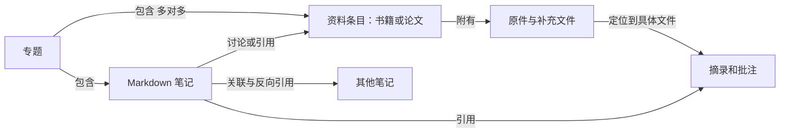

# 以书籍、论文、笔记为中心的个人图书馆与档案馆

日期：2026-09-26  
状态：产品设计与验收合同；已按本方向开发，当前实现及未通过项见 [全范围验收状态](../testing/development-status.md)。本文不以设计描述代替完成证据。  
依据：用户本次确认、[原功能设计](../legacy/功能设计-v1.md)、[原技术方案](../legacy/技术方案-v1.md)、本次代码阅读，以及[官方产品参考研究](../research/reference-products.md)。

## 1. 产品定位与确认边界

TokenLibrary 的核心用途建议定义为：**把收集的书籍和论文，变成能持续阅读、做笔记、回到原文并长期找回的个人资料库。**

“图书馆”负责收集、组织、阅读与研究；“档案馆”负责保存原件、来源和自己的研究成果。两者共用一套资料、标识和搜索，不要求用户建立两份库，也不因归档而复制全部文件。

| 类别 | 内容 |
| --- | --- |
| 本次用户已确认 | 主要资料是书籍、论文、笔记；重视功能完整、稳定和使用体验；iPhone 与 Mac 都遇到了同步连接问题；建立 `docs/` 管理研究、计划、实施和测试文档 |
| 既有已确认范围 | 个人固定账号；iOS、macOS、自建 Linux 服务；Markdown、PDF；本地优先与双向同步；PDF 高亮和文字批注；本地全文检索；图片随笔记同步；导出；30 天回收站；备份；不做 OCR、手写批注和用户可见历史版本恢复 |
| 本文建议 | 书籍/论文条目、收件箱、专题、标签、阅读进度、来源摘录、双向关联和可逆归档；保留现有目录浏览入口 |
| 尚未确定 | EPUB 是否进入下一次新增范围；是否需要从 Zotero/BibTeX 迁入现有论文库；是否有必须支持的引用格式；是否需要纸质书登记 |
| 不作为当前主线 | 身份证、合同、票据等事务档案；多人协作；公有发布；AI 问答；复杂知识图谱；完整参考文献排版系统 |

优先级表示施工依赖和建议，不代表缩减原 F01—F31 的已确认完整交付范围。新方向也不能掩盖当前同步、保存、导出和冲突等未完成的基础能力。

## 2. 现有能力与设计之间的差距

以下是 2026-09-26 本次修改前的代码基线，只代表代码中存在的实现，不代表双端真机、服务端和故障场景已验收。后续修复结果应进入实施与测试记录。

| 领域 | 代码中已有的基础 | 本方向需要补齐 |
| --- | --- | --- |
| 文档身份 | `LibraryDocument` 有稳定 ID、文件夹位置、修订号和同步状态；类型只有 `folder/md/pdf` | 将“资料是什么”和“文件是什么格式”分开；增加书目元数据，不能把 PDF 全当论文 |
| 本地存储 | SQLite/GRDB 文档、待提交队列、搜索数据 | 可迁移的条目/专题/关联/阅读位置模型；明确元数据也参与同步 |
| 文件与正文 | Markdown 正文、PDF 本地路径；服务端有 blob 与文档分离结构 | 文件导入校验、下载状态、内容校验值、原件与补充附件角色、来源记录 |
| PDF 批注 | 批注 ID、页索引、矩形、颜色、文字、可选 blob ID | 专门的摘录正文和来源锚点；跨页摘录；原件变化后的失效处理；跳回原文 |
| 搜索 | 名称、Markdown、可提取 PDF 文字写入本地搜索数据 | 作者/年份/专题/摘录检索，匹配摘要和定位，索引覆盖率提示；目前搜索接口主要返回文档 ID |
| 阅读 | PDFKit 阅读界面和 Markdown 编辑器 | 持久阅读位置、“继续阅读”、待读/在读/已读状态；未发现完整实现 |
| 组织 | 单父目录、改名、移动、回收站 | 多专题归属、归档和标签；当前无独立档案馆语义 |
| 同步与体验 | 客户端登录、提交操作；服务端有同步相关数据结构 | 本次阅读未发现客户端完整远端拉取和文件传输闭环；部分错误由 `try?` 隐藏，导出界面只取数据未完成交付 |

代码入口：[DocumentStore.swift](../../clients/LibraryCore/Sources/LibraryCore/DocumentStore.swift)、[PDFAnnotations.swift](../../clients/LibraryCore/Sources/LibraryCore/PDFAnnotations.swift)、[TokenLibraryRoot.swift](../../clients/Shared/TokenLibraryRoot.swift)、[SyncClient.swift](../../clients/LibraryCore/Sources/LibraryCore/SyncClient.swift)、[服务端初始结构](../../server/schema/initial.sql)。

## 3. 一套库，按任务提供入口

建议顶层采用“最近、资料库、专题、搜索”四个日常入口，设置内提供同步详情、存储和回收站。Mac 展开左侧导航；iPhone 分层进入，避免同时摆出十多个一级入口。

```text
最近
  继续阅读 / 最近编辑 / 待处理提醒
资料库
  全部资料
  收件箱
  书籍（个人书架）
  论文
  笔记
  归档
  文件夹（保留已有组织方式）
专题
  例如：分布式系统 / 某门课程 / 某个研究问题
搜索
  全库搜索与筛选
设置
  账号和服务器 / 同步详情 / 本机存储 / 回收站
```

这些入口的含义必须稳定：

| 入口 | 包含什么 | 用户能做什么 |
| --- | --- | --- |
| 全部资料 | 所有未删除的资料条目，包含归档项并标记 | 查看全库、按类型筛选，避免“文件不知道去哪了” |
| 收件箱 | 新导入且尚未确认整理完成的资料 | 改标题、选书籍/论文、加专题；允许跳过，不阻挡阅读 |
| 书籍 | 标记为书籍的条目 | 按作者/在读状态浏览；列表为默认，封面视图可选且缺封面仍完整可用 |
| 论文 | 标记为论文的条目 | 浏览标题、作者、年份、期刊/会议、阅读状态、来源；默认信息密度高于封面展示 |
| 笔记 | 独立思考、阅读笔记、专题综述 | 编写 Markdown；从来源或专题打开；显示被哪些资料引用 |
| 专题 | 为一个研究问题手动组织的书、论文、笔记集合 | 同一资料加入多个专题；排序、写专题简介与综述；移出专题不删除资料 |
| 归档 | 暂时结束整理、希望长期保存的资料 | 检索、阅读、导出、恢复整理；不自动删除、不等同备份 |
| 文件夹 | 现有层级与文件位置 | 原操作继续可用；专题不会强行改变目录位置 |

“资料条目”按一项资料计数。一个条目关联两个文件，不在书架中变成两本书。文件夹不是资料条目，批注和摘录在条目内可见且可以单独搜索，但不挤占主列表。

收件箱采用明确的“待整理”状态，不能简单定义为“未加专题”：用户可能故意不按专题分类。点击“整理完成”即可离开收件箱，无需填满所有字段。

## 4. 资料条目、文件、笔记与关系

### 4.1 作品与文件分离

这里的“作品”用简化的资料条目表示，不引入完整图书馆编目体系。书籍条目默认对应一个明确版本或译本；论文条目默认对应一项可识别的文献。不同版次、不同译本、实质不同的论文版本允许建立独立条目并关联，不能仅凭标题相同合并。



最低可用规则：

- 导入 PDF 后立即有可阅读的资料，不强制填写作者、DOI 等信息；类型未确认时显示“待分类”。
- 导入 Markdown 默认是笔记，原始 Markdown 保留；正文不是书目元数据的存储容器。
- 资料标题与物理文件名分开。修改标题不会悄悄重命名导入原件，也不会改动外部 URL。
- 条目可以先只有元数据，文件显示“未添加全文”；这一状态必须与“全文待下载”“下载失败”区分。
- 数据模型允许一个资料关联多个文件；首个完整实现先覆盖一个主 PDF 与关联笔记，不把多格式转换变成前置条件。
- 后续添加同一资料的补充 PDF 时选择“关联到现有资料”；存在不同版本时展示文件角色或版本说明，阅读位置不混用。
- 识别相同内容的文件可以提示“已在库中”，默认打开已有资料；用户仍可明确保留独立条目。文件 hash 只表明字节相同，不足以推断书目条目相同。

### 4.2 最小元数据

| 类型 | 首屏建议字段 | 可折叠字段 |
| --- | --- | --- |
| 通用 | 标题、类型、专题、标签、阅读/整理状态 | 来源 URL、导入日期、原始文件名、文件大小、创建与修改时间 |
| 书籍 | 作者、出版年份 | ISBN、出版社、版本/译本、语言；封面可选 |
| 论文 | 作者、年份、期刊或会议 | DOI、arXiv 标识、摘要、语言、版本说明 |
| 笔记 | 标题、关联来源 | 笔记用途（随手记/阅读笔记/综述）、标签 |

除标题外都允许暂缺。作者保留顺序，支持机构名；年份不要求完整出版日期。读取 PDF 自带元数据只作为建议值，不能静默替换用户填写内容。外部 DOI/ISBN 查询由用户触发；展示来源与待确认变更，网络失败不影响已导入原件。

### 4.3 关联与双向可见

先实现两类关系：

1. **引用**：笔记引用资料、摘录或另一笔记。方向保留；被引用项显示“引用我的笔记”。
2. **相关**：用户手动建立的对称关系，例如一本书与其读后感、某论文的前后版本。

相关关系不自动传递；A 关联 B、B 关联 C，不自动断言 A 关联 C。专题共现也不自动生成引用。

关联以稳定 ID 保存，界面显示当前标题。改名、移动和归档不损坏关系；目标进入回收站时保留引用与可理解的提示，不删除引用方正文。Markdown 内链接的最终语法须在编辑器往返验证后冻结；建议应用内保存稳定目标，导出时转换为可读名称、相对路径与页码说明，同时输出关系清单，不能只留下专用链接。

## 5. 阅读、摘录与笔记形成闭环

### 5.1 阅读状态与位置

阅读状态建议为“待读、在读、已读、仅作参考”。用户主动选择“已读”，翻到最后一页不等于读完；归档状态与阅读状态互不替代。

阅读位置绑定到具体文件 ID/校验值，保存 PDF 页索引、显示页码及可选页内位置。页索引和 PDF 印刷页码不同，不能混用。界面展示“第 18 / 240 页”，没有可靠进度分母就只展示页码。

每个设备先保存自身阅读位置；同步另一设备的位置作为“在 Mac 阅读到第 18 页，可继续”的提示。合并以服务器接收顺序记录可用候选，并保留设备来源；当前正在读时不被远端进度强行跳页，不用两台设备的本地时钟裁定正文或批注。重读也可能回到更前面的页，不能使用最大页码代表最近位置。

### 5.2 摘录的最低数据要求

摘录包含：独立 ID、来源条目 ID、文件 ID/校验值、批注 ID（如有）、PDF 页索引和页面标签、一个或多个位置矩形、摘录文本、用户评论、创建时间。

- 选中文字后可“高亮”“写备注”“加入笔记”；加入笔记保留文字与来源定位。
- 来源信息至少可读为“作者／标题／第 X 页”。点击后回原件；下载未完成则先展示下载状态和重试。
- 引用文字与自己的评论分开，避免导出时混成作者原话。
- 复制摘录到笔记产生引用快照，后续修改高亮颜色不会改写用户笔记；如果源摘录删除，保留已写入笔记的文字和失效标记。
- PDF 替换导致校验值变化时，旧摘录不能静默跳到新文件相同页号。保留可读的摘录内容，显示“来源版本已变化，位置待核对”。
- 无可提取文字的扫描 PDF 可记页备注；不宣称全文可检索，不自动生成文字摘录，也不扩展为 OCR。

### 5.3 完整体验要求

Mac 适合原文与笔记并排；iPhone 用阅读界面内的“摘录与笔记”抽屉和返回来源按钮，不要求在多个顶层页面来回寻找。

文档保存成功与同步成功分开显示。摘录、笔记正文、关联记录应在同一本地事务中确认，避免出现“笔记中有摘录但来源不存在”；网络队列不能阻塞这一事务。PDF 文件仍在传输时，元数据和已下载笔记可以使用。

## 6. 档案馆的语义与保存边界

归档用于降低日常列表噪声、保留研究成果。它不是删除，也不是“服务器已经做过备份”的保证。

| 对象 | 归档后行为 | 继续使用 |
| --- | --- | --- |
| 书籍/论文 | 默认不出现在“正在处理”列表；原件、书目信息、专题关系、摘录仍可查 | 阅读和导出不必取消归档；继续编辑资料信息时可选择“恢复整理” |
| 笔记 | 默认阅读展示，仍能被搜索和引用 | 明确点“继续编辑”即可恢复整理，不新建副本、不删除旧内容 |
| 专题 | 从活跃专题收起，保留专题说明与成员关系 | 重新打开专题；不能自动归档同时属于其他专题的共享资料 |

全库搜索默认包含归档项并显示标识，可切换“仅活跃/仅归档”；回收站默认排除。归档资料不设 30 天到期时间，只有明确执行删除才进入既有回收站流程。

**原件保存**：导入成功后保留原始字节、文件名、导入时间、可得的来源 URL 与校验值。高亮与批注独立保存；“导出带批注 PDF”生成导出文件，不覆盖原件。替换文件应采用显式操作，保留引用失效处理，不顺带承诺用户可见历史版本恢复。

**笔记保存**：归档不等于建立不可变快照。当前仍以 Markdown 正文和相关附件为真值，延续原“不提供历史恢复”的边界；自动历史快照、法律证据保全或不可篡改存证均不在本建议基础范围。

**带走资料**：单篇支持原 PDF、带批注 PDF、Markdown 加相关图片；专题/整库归档包作为新增建议，包含原件、Markdown、元数据、关系/来源清单和校验清单。大文件导出应流式处理，并提示包含/缺失哪些原件；只有元数据的资料不能被包装成“完整离线档案”。本地归档、服务器接收、备份成功、导出校验必须分别报告。

## 7. 搜索设计

入口提供自然关键词，筛选作为可选条件：资料类型、作者、年份范围、专题、标签、阅读状态、归档状态、是否有本机全文。不要求用户学习查询语言。

结果按资料聚合，同一论文多个页面命中不会挤满主列表。每条展示标题、资料类型、匹配字段/摘要和来源位置；展开能看到正文、摘录、笔记命中。点 PDF 命中跳页，点笔记命中定位标题或段落。

检索覆盖标题、可用元数据、Markdown 正文、PDF 自带文字层、摘录和评论。没有下载/尚未索引的文件显示覆盖提示，例如“另有 3 份 PDF 尚未下载，暂不包含其正文”；零结果时区分没有匹配与索引尚未完成。

默认不加入语义搜索、联网答案或自动摘要。先验收中英混合、中文短词、作者名、DOI 精确匹配及原文定位，再评估其他方式。

## 8. 两端的基础体验是前置条件

本轮用户明确指出两端都连接不上；所有新增资料功能都依赖同一套连接与同步体验。

- 登录失败应区分地址错误、网络不可达、超时、证书/安全连接错误、认证失效、服务暂不可用与协议不匹配，给出对应行动。
- 显示“本机保存完成”“待同步 X 项”“最近成功时间”和失败原因。只有服务端确认了对应提交才标记已同步；这不代表另一台离线设备已收到。
- 网络错误采用有上限的退避重试；恢复联网/前台时调度重试；手动“立即重试”复用同一队列，防止并发重复请求。
- 认证失效转为需要重新登录，不无限重试；已登录设备仍可读写已存本机的资料。证书错误不能通过关闭校验解决。
- 断网期间导入、写笔记、摘录、归档都先可靠落盘。不能用弹窗反复中断阅读；当前操作失败要就地说明，后台问题集中在同步详情。
- 导入、导出、移动、冲突处理按钮必须对应完整结果：能验证成功、取消、失败和重试，不能仅触发一个未被使用的返回值。

这些是已有需求的体验落点，不是把“修复同步”缩减成增加一个重试按钮。

## 9. 可实施的数据与兼容策略

以下是待实施的模型建议，实际字段名和 API 应在协议文档中冻结。

| 模型 | 建议字段与关系 | 迁移重点 |
| --- | --- | --- |
| `library_items` | `id`、`kind(book/paper/note/unclassified)`、标题、书目字段、`organizing_state(inbox/organized/archived)`、阅读状态 | 与现有文件格式 `DocKind` 分开；不把归档写入现有 `state=trashed` |
| `item_documents` | 条目 ID、现有文档 ID、文件角色、默认打开项 | 旧文档 UUID 不变；初始一条资料对应原文档，后续可关联多个 |
| `collections` / `collection_members` | 专题 ID、名称、说明、归档状态；资料 ID 与专题 ID | 多对多，移出只删关系；删除专题不删除成员资料 |
| `tags` / `item_tags` | 标准化名称、资料关系 | 手工管理，不强制自动导入网络关键词 |
| `source_links` | 引用方 ID、被引条目/文档/摘录 ID、关系类型、定位与摘录快照 | 反向引用从关系索引计算，不维护两份容易漂移的正文 |
| `reading_positions` | 文档 ID、文件版本、设备 ID、位置、同步修订信息 | 合并位置不覆盖正文；不强迫当前阅读跳页 |
| `import_records` | 文档 ID、原文件名、大小、hash、导入时间、来源与元数据来源 | 不以文件路径作为跨设备身份；路径仅为本机实现细节 |

建议施工顺序及完成门槛：

1. **先完成基础闭环**：双端本地保存、会话恢复、同步收敛、文件传输、原件校验、导出与错误反馈。通过双端及故障验收后再让新结构承担真实资料。
2. **加目录层而不搬原件**：通过版本迁移增加条目和关系表。旧 Markdown 映射为笔记，旧 PDF 映射为待分类资料，保留原 ID、父目录、内容、批注、队列和同步修订；现有资料不全部强行塞回收件箱。
3. **接通收集与组织**：新导入默认待整理；资料详情、书籍/论文/笔记视图、专题和搜索筛选共用数据源。元数据和关系必须先有端到端同步，再显示可跨设备使用的承诺。
4. **接通研究循环**：阅读位置、摘录→笔记→来源、反向引用、归档与导出清单。每个功能随实现提交可复现测试证据。
5. **再评价格式与自动化扩展**：EPUB、BibTeX/RIS、DOI/ISBN 查询和批量迁入使用真实样本验证，独立核算，不成为修复当前功能的阻塞项。

服务端已有初始结构指纹校验，不能只修改 `initial.sql` 假装完成升级。需要增量迁移、升级前备份、失败原子回滚和升级后数据对账。SQLite 同样增加版本迁移；失败不清空原库。

协议必须有功能能力协商。旧客户端不得读取新资料后提交整个对象并抹掉未知元数据；上线前选择“服务端分领域更新、保留未知字段”或“新能力要求最低客户端版本”。迁移没有改变的旧文档不产生全库重传。取消升级通过备份恢复及受控客户端版本处理，不能用删除新增表作为有新资料后的回滚策略。

## 10. 新格式与元数据扩展的优先级

| 建议顺序 | 能力 | 收益与边界 | 纳入实施前需要确定 |
| --- | --- | --- | --- |
| P0：原范围必需 | 现有 Markdown/PDF 的可靠保存、同步、批注、搜索和导出 | 是新个人资料库可信的前提；原已确认能力仍须完整交付 | 双端故障验收环境与真实样本 |
| P1：本方向核心建议 | 资料分类、最小元数据、收件箱、专题、阅读位置、来源摘录、关联、归档 | 可在已有 Markdown/PDF 上形成阅读研究闭环 | 本文默认交互在试用中的反馈 |
| P2：高价值扩展 | BibTeX/RIS 导入导出 | 论文库迁入和带走书目信息；不自动获取全文，不等于 Word 引文插件 | 用户是否已有文献库，字段映射、编码和重复项样本 |
| P2：高价值扩展 | DOI/ISBN/arXiv 元数据查询 | 减少输入；保留来源、允许修正、网络失败可手填 | 查询来源、字段覆盖、频率限制、超时与缓存策略 |
| P2：按书籍样本评估 | EPUB 阅读 | 对流式书籍有价值；需新的阅读器、定位、目录、字体排版、离线和两端一致性 | 实际 EPUB 占比；不把支持导入等同可读、可批注、可同步 |
| P3：有需求再定 | 保存搜索、整库/专题导出包、引用格式生成、扫描件 OCR、网页收集 | 各自是独立可验收范围；OCR 会改变原明确边界 | 用户用途、格式/存储预算和维护成本 |

官方参考支持这些能力的价值判断，但不证明 TokenLibrary 已具备它们。尤其 EPUB 不能只把扩展名加到文件选择器；BibTeX/DOI 也不等于自动拿到 PDF。

## 11. 完整用户旅程与验收

所有下述 L 编号为本次新方向的验收项。已有部分代码和自动测试证据，完整双端用户旅程仍须逐项验证；结果见 [全范围状态](../testing/development-status.md)。基础可靠性项映射到原 F 编号；至少在一台 iPhone、一台 Mac、一个隔离测试服务端上验证。

### 旅程 A：收一篇论文，读完后形成自己的理解

Mac 导入 `paper.pdf` → 原件保存完成并进入收件箱 → 标为论文，补作者/年份，加入“分布式系统” → 不填 DOI 也能开始阅读 → 第 8 页高亮后写评论 → “加入阅读笔记” → 笔记里补写自己的理解 → 点击来源回到第 8 页 → 在 iPhone 看到同一资料、摘录和笔记。

验收：L01 导入中断不出现不可打开的成功条目；L02 原件 hash 不因书目信息/批注改变；L03 任一来源关系改名和移动后仍可跳转；L04 另一设备的原件尚未下载时解释原因并可重试，不报“文件损坏”；L05 笔记内的引用文字与评论可区分并可导出。

### 旅程 B：一本书在两个设备间继续阅读

导入 PDF 书籍并标为书籍 → 在 Mac 阅读至第 30 页 → iPhone 下载完成后断网 → 离线打开同一本书、写摘录和读书笔记 → 杀掉并重启应用 → 本机内容仍在 → 联网后补齐 → Mac 提示手机的阅读位置，不在用户正在阅读时自动跳走。

验收：L06 离线重启可读写已经下载的书和笔记；L07 重试不重复创建摘录；L08 阅读位置绑定同一文件版本；L09 手机回看第 10 页不会被“取最大页码”强行改回第 30 页；L10 认证过期保留本地工作并给出重新登录入口。

### 旅程 C：围绕一个问题整理多份材料

新建“共识算法”专题 → 加入两篇论文和一本书 → 某论文也加入“数据库课程” → 新建专题综述，引用多份资料 → 从论文详情看到“被这篇综述引用” → 将论文移出“数据库课程” → 原件和其他专题关系继续存在。

验收：L11 多专题只增加关系，不复制 PDF、不翻倍计数；L12 移出专题与删除资料为不同命令；L13 关系双向可见，改名不损坏；L14 删除专题保留资料；L15 全库查找能跨专题返回同一条资料。

### 旅程 D：一个研究专题告一段落并长期找回

整理好综述 → 归档专题 → 活跃专题列表收起，但共用的论文仍留在其他活跃专题 → 单独归档不再处理的资料 → 一个月后全库搜索作者或摘录文字 → 找到归档项 → 打开来源并导出 Markdown/原 PDF → 明确“恢复整理”后继续写作。

验收：L16 归档项不设置回收站到期时间，过 30 天仍在；L17 搜索默认包含归档项并显示标识；L18 归档不删原件、不新增副本、不宣称已备份；L19 单篇导出能在应用外打开，图片与来源说明可用；L20 继续编辑不意外恢复整个专题其他成员。

### 旅程 E：遇到重复、替换或连接问题

再次导入同一文件 → 系统提示已有内容并可打开旧条目 → 选择另一修订 PDF 关联到同一资料 → 旧摘录仍指向旧来源，无法定位时明确待核对 → 此时服务器断开 → 本地修改继续保存，界面显示等待重试 → 服务恢复后收敛且不重复创建。

验收：L21 不以同名或同 DOI 自动覆盖已有原件；L22 文件版本不一致时不静默复用批注坐标；L23 连续重试不重复文件、条目、专题关系或笔记引用；L24 错误原因、最近成功时间与行动入口可见；L25 成功连接不被误报为全库同步完成。

### 数据升级与可用性验收

| 编号 | 场景 | 必须观察到的结果 |
| --- | --- | --- |
| L26 | 旧库升级，包含目录、中文名、PDF、图片、批注和未同步编辑 | ID/目录/内容校验值与未提交操作保留；不自动清库、不强行猜测 PDF 类型 |
| L27 | 两端版本不一致 | 未支持的新字段保留或明确要求更新；旧客户端不能把新元数据清空 |
| L28 | 1000 项以内混合资料查询 | 按原性能目标实测并记录设备、数据集、P95；不把文档指标当测试结果 |
| L29 | PDF 部分下载、部分无文字层、部分尚未索引 | 搜索解释覆盖范围，不把未搜到误表述为全文不存在 |
| L30 | VoiceOver、较大字体、键盘与单手操作 | 状态不只依赖颜色；按钮可访问；iPhone 来源跳转可返回笔记；Mac 主流程可键盘操作 |

## 12. 下一步的具体决策

当前可以直接推进已有同步和体验问题修复、测试证据补齐以及兼容性方案。新方向默认先以 PDF 书籍、PDF 论文和 Markdown 笔记设计，无须等 EPUB 或元数据联网服务才能验证信息架构。

在新增格式和批量迁入前，只需围绕真实样本收集三个答案：现有书籍中 EPUB 占多少；是否已有 Zotero/BibTeX/RIS 资料；论文引用是否需要固定格式。答案影响扩展顺序，不影响基础修复，也不应再阻塞已授权的研究和文档工作。
