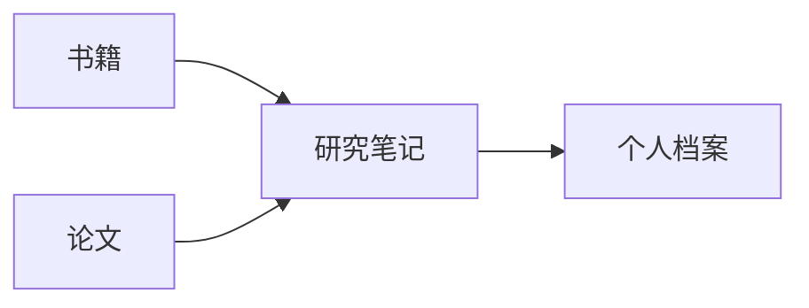

# 离线公式与图表验收

此笔记只包含本地 Markdown，没有外链、远程图片或网络数据。

## Mermaid

## 行内公式

质能关系为 $E = mc^2$，勾股关系为 $a^2 + b^2 = c^2$。

## 块级公式

$$
\int_0^1 x^2\,dx = \frac{1}{3}
$$

## 本机检查

切到阅读模式，应显示流程图、上下标、积分和分数；离线重开后仍能显示。
